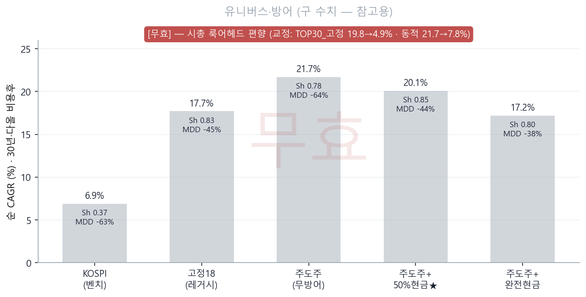
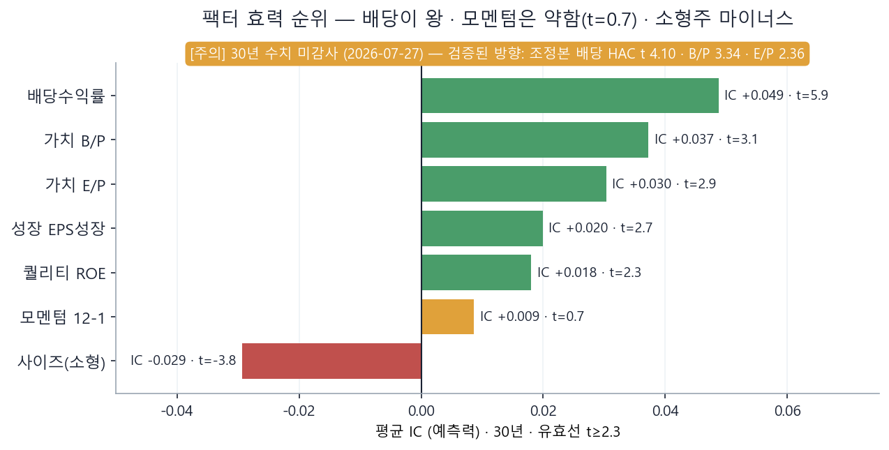
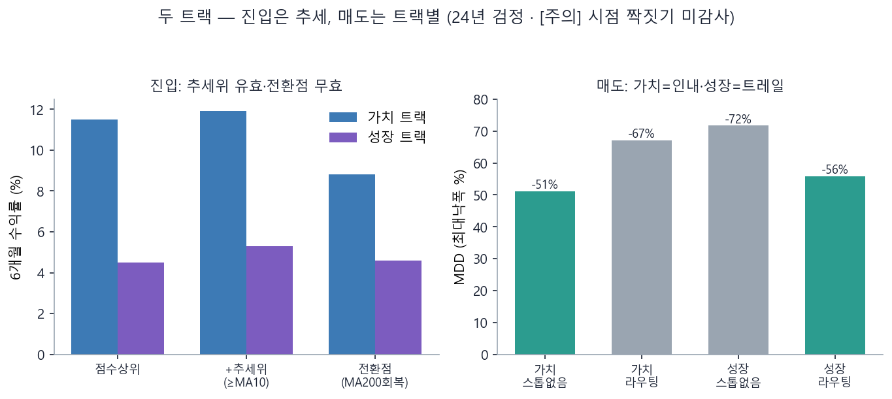
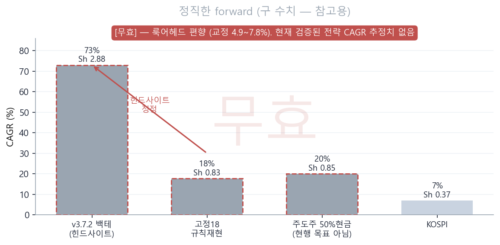

# 진우퀀트 (Jinwoo Quant) 종합 기술 백서

> 📄 **먼저 읽을 것: [`현재상태_한장.md`](현재상태_한장.md)** — 지금 무슨 질문에 답하는 중이고 어디까지 왔는지 A4 한 장. 이 백서는 그 근거다.


**한국주식 퀀트 트레이딩 연구·운영 시스템 — 발전 현황 보고서 (2세대 개정판)**

문서 성격: 종합 기술 백서 + 경영 요약 · 대상: 진우

> **⚡ 2세대 전환 안내 (중요).** 이 백서는 **현행 시스템 = 주도주 동적 유니버스 + 가치/성장 2트랙 + 배당 최강 멀티팩터**를 기준으로 개정되었습니다. 초기의 **v3.7.2(고정 18 대형주·모멘텀 중심)는 "발전사(10장)"로 이동**했습니다 — 넓은 30년 패널에서 정직하게 재검증하니 모멘텀은 약했고(IC t=0.7) 배당·가치가 이겼기 때문입니다.
>
> **단일 진실원천(SSOT).** 이 백서는 "왜/어떻게"의 레퍼런스입니다. **라이브 수치(오늘의 추천·보유·집행)의 진실은 항상 `강화키트\진우퀀트_허브.html`와 그 산출물**입니다. 백서의 숫자는 검증 시점 기준이며, 최신값은 허브를 보세요.

---

## 경영 요약 (Executive Summary)

진우퀀트는 "**검증된 규칙으로만 매매한다 — 추측이 아니라 30년 데이터의 증거로**"를 원칙으로 삼는 한국주식 퀀트 시스템입니다. 자동매매 로봇이 아니라 개인 운용을 위한 **의사결정 지원 도구**입니다.

**현행 시스템(2026-07)의 심장**은 5단계 파이프라인입니다: **① 주도주 top30 동적 유니버스 → ② 가치/성장 2트랙 분리 → ③ 배당 중심 멀티팩터 점수 → ④ 추세 레짐 진입 → ⑤ 트랙별 매도·사이징.** 최종 산출은 `risk_manager.py`의 집행 시트 한 장(종목·비중·손절가·매도규칙)입니다.

지난 세대(v3.7.2, 고정 18 대형주)와의 핵심 차이는 **정직성**입니다. v3.7.2 백테는 CAGR 73%·Sharpe 2.88을 보였지만, 이는 손으로 고른 18종·특정 구간의 **힌드사이트(사후선택)**였습니다.

> 🔴 **[요약 갱신 · 2026-07-27]** 종전 이 자리엔 *"기계 재현하면 연 17~20%·Sharpe 0.8대가 정직한 값이고 KOSPI를 크게 앞섭니다"* 라고 적혀 있었다. **그 문장은 폐기한다.**
> 그 수치는 룩어헤드 편향 · 시총 12월 결측 · 조정본 커버리지 붕괴 세 결함 위에 서 있었다(부록 B-1b·B-1d·B-1e).
>
> 셋을 모두 고치고 복원본 30년(366개월)으로 재산출한 값은 **연 4.1~8.6%**다(부록 B-1h).
> 그리고 **실제 운용 종목수(본체 8~15종)에서는 KOSPI(PR) 7.7%를 이기지 못한다** — N=15에서 7.1%(부록 B-1i).
> 블록 부트스트랩 2,000회 기준 **KOSPI 초과 확률은 46~57%** — 동전 던지기와 구별되지 않는다.
>
> **결론: 이 시스템이 지수를 이긴다는 증거는 현재 없다.** 30년 백테로는 판별할 통계적 힘 자체가 없고,
> **§8-6 forward 실측(현재 1/12개월)이 유일한 진짜 검증**이다.
> 잃지 않은 것은 팩터 방향성·검증 방법론·데이터 인프라·운영 파이프라인, 그리고 자본이다.

**핵심 발견(30년 수치는 🔶 미감사 — 검증된 크기는 조정본 2015+ 기준, 4장 참조):** 배당수익률이 가장 강한 팩터(IC +0.0487, t=5.9)이고, 가치(B/P·E/P)가 그다음, 성장은 부차, **종목선택용 횡단면 모멘텀은 약하며(t=0.7, 단 시계열 추세는 유지)**, 소형주는 마이너스(대형주 우위). 미국식 정교한 밸류(EV/FCF)는 한국에서 단순 배당·E/P를 못 이깁니다("정교함 ≠ 알파").

| 항목 | 값 |
|---|---|
| 현행 파이프라인 | 주도주 유니버스 → 2트랙 → 배당 멀티팩터 → 추세진입 → 트랙별 매도 |
| 최강 팩터 | **배당수익률** — 검증된 크기 **롱숏 +3.4%/년 · IC HAC t 4.10** (조정본 2015~2026) · 🔶 30년 +10.3%는 미감사 |
| 멀티팩터 합성 | 🔶 30년 IC +0.047 · 롱숏 +12.3% **미감사** · 규칙화 검증본은 **10.0%** (2015~2026 조정본, KOSPI 13.8% 미달) |
| 정직한 forward | 🔴 **무효 유지** — 재산출 완료(4.1~8.6%)했으나 운용 N(8~15종)에서 지수 미달·초과확률 46~57% → **대체할 유효 수치 없음** (B-1h·B-1i) |
| 유니버스 | 주도주 동적 + MA200 방어 · **검증 N=30 / 운용 N=8~15 (격차 확인됨, B-1i)** |
| 사이징 | **본체=동일가중+종목캡15%+섹터캡35%** · 재량=리스크 1%·heat ≤6% · 계좌 최대 15종 (둘을 혼동하지 말 것, B-1c) |
| 자동화 | 매주 월 추천·카톡 발송 · 매월 재검증 · 허브 자동 갱신 |
| **운용 사양** | 백서 아님 → **`실전준비\전략서_v2.md`** (v2.0 사전등록 2026-07-27) · forward 트랙 = `forward_병행관찰_v1.2_부속서.md` |
| SSOT | 라이브 수치 = `진우퀀트_허브_자립형.html` · 비용 = `비용모델.py` · 한도 = `진우_통합한도.json` · 빌드 게이트 `진우퀀트_게이트.py` (G1~G9) |

---

## 1장. 진우퀀트란 무엇인가

### 1.1 정체성과 철학
개인 투자자 "진우"의 한국주식 퀀트 연구·운영 시스템입니다. 세 원칙이 전체를 관통합니다. 첫째, **검증된 규칙만 시스템으로 삼는다** — 공식 실데이터, 30년 상폐포함 패널, 룩어헤드 차단. 둘째, **안 되는 것을 걸러내는 일을 되는 것 찾기만큼 중시한다** — 사전등록 후 대부분 기각. 셋째, **정직성** — 백테 수치를 forward로 쓰지 않는다.

> 💡 **쉬운 설명.** 퀀트는 "감이 아니라 숫자·규칙으로 투자"하는 방식입니다. 진우퀀트의 태도는 "그럴듯한 전략을 찾으면 일단 의심한다"입니다. 백테가 좋아도 미래를 보장하지 않기 때문입니다.

### 1.2 대상 시장 — 주도주 중심, 대형주 우위
KOSPI+KOSDAQ 전체에서 **매월 시총·모멘텀 상위(주도주) top30을 동적으로 재선정**합니다. 30년 검증 결과 **소형주는 마이너스(IC −0.029)**라 대형·주도주에 집중하는 것이 옳습니다. 초기의 "고정 18 대형주"는 명단을 고정한 hindsight였고, **리더셋은 매년 42%가 교체**되므로 규칙 기반 월간 재선정이 정답입니다(3장).

### 1.3 토대 데이터 — 4대 안전장치

| 자산 | 내용 |
|---|---|
| 가격 패널 | 1996~2026 · 상폐 포함 · 약 5,000종목 |
| 재무 패널 | KRX 배당·PER·PBR·성장 (최신 확정월 사용) |
| 안전장치 | ① 상폐 포함(생존편향 제거) ② 거래비용 반영(다올: 수수료0·세금0.2%) ③ OOS 봉인 ④ 사전등록 |

> 💡 **생존편향.** 상폐 종목을 빼면 성적이 부풀려집니다. 진우퀀트는 상폐 포함 패널로 이를 차단합니다 — 그래서 정직한 숫자가 낮게 나옵니다.

---

## 2장. 현행 시스템 — 5단계 파이프라인

```
① 주도주 유니버스      ② 스타일 분리        ③ 배당 멀티팩터      ④ 추세 진입         ⑤ 트랙별 매도·사이징
  시총·모멘텀 top30  →   저PBR 가치 /     →   배당+가치+성장    →   점수상위 &      →   가치=인내
  + MA200 방어          고PBR 성장           IC가중 z-score         추세위(≥MA10)        성장=트레일
```

최종 산출: `risk_manager.py`(집행 시트) · `recommend_dashboard.py`(추천 대시보드) · 카톡 요약. **진우님이 매주 볼 건 딱 하나** — 월요일 아침 추천 대시보드의 4칸(종목·비중·손절가·매도규칙).

> 💡 **왜 2트랙인가.** 팩터가 스타일마다 다르게 작동하기 때문입니다(5장). 섞으면 상쇄되고, 저PBR(가치)/고PBR(성장)로 나누면 각자 맞는 팩터가 보입니다.

---

## 3장. 유니버스 — 주도주 동적 리더십 + 방어

**질문:** 대형주만 고정하는 게 맞나, 매번 주도주를 확인해야 하나? → **정식 사전등록 검정(30년 상폐포함·다올 비용)으로 판정.**



| 유니버스·방어 | 순 CAGR | Sharpe | MDD | 회전/년 |
|---|---|---|---|---|
| KOSPI (벤치) | 6.9% | 0.37 | −63.3% | — |
| 고정18 (레거시·재현) | 17.7% | 0.83 | −44.9% | 0.1x |
| 주도주 top30 (무방어) | 21.7% | 0.78 | −64.3% | 2.8x |
| **주도주 + 50%현금 방어 ★** | **20.1%** | **0.85** | −44.2% | 2.2x |
| 주도주 + 완전현금 방어 | 17.2% | 0.80 | **−37.6%** | 1.7x |

**판정 = 3/4 (조건부 통과).**

> 🔴 **[전면 무효 → 재산출 완료 · 2026-07-27]** **위 표 전체가 룩어헤드 편향으로 무효다.**
> 재산출본은 이 상자 끝에 있다(부록 B-1h). **무효 판정은 유지되고, 대체값이 생겼다.**
>
> `종목시총_30년.csv`의 date는 **월말 스냅샷**인데 백테가 이 시총으로 **같은 달의 수익률**을
> 계산했다. 그 달에 오른 종목이 사후에 큰 시총을 가지므로 **자동으로 승자를 선택**하게 된다.
> 모멘텀 창은 시차 처리가 정확했기에(`px.iloc[i-13:i-1]`) 이 축이 검토에서 빠졌다.
>
> **[중간 교정 · 7/27 오전]** 시총만 shift(1) 한 1차 교정값:
>
> | 전략 | 본 표 | 1차 교정 | 차이 |
> |---|---|---|---|
> | TOP30_고정 (베이스라인) | 19.8% | 4.9% | -14.9%p |
> | 동적_TOP30_리더십 무방어 | 21.7% | 7.8% | -13.9%p |
> | 전종목 시총가중 (KOSPI 프록시) | 19.3% | 4.4% | -14.9%p |
> | KOSPI (본 표 기재) | 6.9% | - | - |
>
> ### ⭐ 재산출 완료 · 2026-07-27 (부록 B-1h)
>
> 위 1차 교정도 **아직 결함 위에 있었다** — 시총 12월 결측(B-1d) · 조정본 커버리지 붕괴(B-1e).
> 셋을 다 고친 최종본(복원본 · 366개월 · 상폐포함 100% · CA 보정 · 실측비용):
>
> | 전략 | 본 표 | **최종 교정** | 낙관~보수 | Sharpe | MDD |
> |---|---|---|---|---|---|
> | TOP30_고정 | 19.8% | **4.1%** | 3.5~4.3% | 0.28 | -71.6% |
> | 동적_리더십 무방어 | 21.7% | **5.3%** | 2.6~6.2% | 0.32 | -80.8% |
> | 전종목 시총가중(프록시) | 19.3% | **3.9%** | 3.7~4.0% | 0.28 | -71.3% |
> | **동적_리더십 +방어50%** | - | **8.6%** | 5.9~9.5% | **0.45** | -56.7% |
> | KOSPI (PR, 실측) | 6.9% | **7.7%** | - | 0.40 | -69.6% |
>
> *(본 표의 KOSPI 6.9%는 미완료월 2026-07을 포함한 값이었다. 연속 366개월 기준은 7.7%.)*
>
> 교정 후 시총가중 프록시 4.4%가 KOSPI 6.9%와 같은 자리에 선다 -
> **"TOP30이 KOSPI를 연 12.9%p 이긴다"는 미스터리가 룩어헤드였다.**
> 재현 충실도: 미교정 재현값(20.9%/22.6%)이 본 표(19.8%/21.7%)와 1%p 이내 일치.
>
> **남은 것:** 교정 후에도 동적 리더십 **5.3% > 베이스라인 4.1%(+1.2%p)**, 방어를 더하면 **8.6%**로
> KOSPI(PR) 7.7%를 **+0.9%p** 앞선다 — **단 보수 비용 시나리오에선 5.9%로 −1.8%p 진다.**
> 그리고 이 값은 **롱온리 top30 동일가중**의 값이지 **운용 중인 15종·리스크사이징**의 값이 아니다(B-1c).
> 종전 문장 -
> 모멘텀 리더십의 상대 우위는 살아 있다. 단 MDD가 -48%→**-73.6%**로 악화.
> **재산출 전까지 이 장의 수치는 사용 금지.** 재현: `lookahead_shift_test.py`
 ① 주도주 추종은 수익을 키우지만(무방어 21.7%) **MDD −64%는 실전 불가**. ② **MA200 방어가 낙폭을 제어** — 50%현금 방어가 스윗스팟(**MDD −44%·CAGR 20.1% 유지·Sharpe 0.85로 전 유니버스 최고**). ③ 다만 "재현가능 대형주 베이스라인 대비 위험조정 초과"는 고슬리피지에서 얇아짐(게이트 G4 미달) — 규율이 정확히 걸러낸 지점.

> 🔴 **위 ①②③은 무효 표에 대한 해석이므로 함께 무효다.** 특히 "스윗스팟"·"전 유니버스 최고"는 룩어헤드로 부풀린 수치에 근거한 표현이다. 방어의 낙폭제어 방향성만 별도 재검증 대상으로 남긴다(교정 후 MDD는 −48%→−73.6%로 오히려 악화).


**결론:** 명단을 고정하면 다음 국면에서 stale(리더셋 연 42% 교체, 2026 대형주 쏠림 사상최대 56.1%). **규칙 기반 월간 재선정 + MA200 방어**가 답. 진우 직관("주도주를 매번 확인")이 데이터로 지지됨.

> ⚠️ **정직 정정.** 고정18의 "73%"는 힌드사이트입니다. 같은 로직 30년 기계재현 **17.7%**(보수적 기준 백테스트·forward 아님, 부록 B-2)가 백서 전체가 쓰는 기준입니다.

---

## 4장. 팩터 근거 — 배당이 왕

30년 상폐포함·유동 top200에서 팩터별 예측력(IC)과 롱숏 성과를 측정했습니다.

> 🔶 **[미검증 · 2026-07-27]** 아래 30년 수치는 **3장과 같은 코드 계열**(당월 수익률)에서
> 산출됐다. 3장에서 룩어헤드가 확인됐으므로 **동일 결함 가능성이 있으나 아직 감사되지 않았다.**
> 특히 배당 롱숏이 30년 **+10.3%** vs 같은 미조정 2015~2026 **-2.5%**로 벌어진다.
>
> **✅ 검증 통과:** 조정본 2015~2026 IC - 배당 HAC t **4.10** · B/P **3.34** · E/P **2.36**,
> 롱숏 배당 **+3.4%/yr** · B/P **+6.6%/yr** (`mini_factor_adj.py`, forward 수익률,
> 생존편향 없음·재무 PIT 시차 정상). **방향성 확정, 30년 크기는 감사 대기.**




| 팩터 | 평균 IC | t값 | 롱숏(연) | Sharpe | 판정 |
|---|---|---|---|---|---|
| **배당수익률** | **+0.0487** | **5.9** | +10.3% | 0.68 | ★ 최강 |
| 가치 B/P | +0.0372 | 3.1 | +10.5% | 0.48 | 유효 |
| 가치 E/P | +0.0303 | 2.9 | +8.8% | 0.48 | 유효 |
| 성장 EPS성장 | +0.0199 | 2.7 | +8.1% | 0.62 | 유효 |
| 퀄리티 ROE | +0.0180 | 2.3 | +2.4% | 0.16 | 약 유효 |
| 모멘텀 12-1 | +0.0086 | **0.7** | +5.3% | 0.24 | ❌ 유의성 없음 |
| 사이즈(소형) | −0.0293 | −3.8 | −7.7% | −0.5 | ❌ 마이너스(대형 우위) |

**멀티팩터 합성** (IC 가중: 배당 0.049 · B/P 0.037 · E/P 0.030 · 성장 0.020 · ROE 0.018, 각 팩터 월별 횡단면 z-score): **합성 IC +0.047 · 롱숏 +12.3%/년 · Sharpe 0.64 · 승률 60%** — 단일 최강(배당) 대비 개선.

> ⚠️ **크기 주의(부록 B-1).** ~~위 롱숏 수치의 "크기"는 잠정치입니다.~~ 🔶 **[해소 · 2026-07-27]** 수정주가 재수집 완료(부록 B-1a). 확정 크기는 조정본 배당 **+3.4%/yr** · B/P **+6.6%/yr**이며, 배당은 미조정 대비 **부호가 역전**됐다(−2.5%→+3.4%). **IC·순위·유의성(방향)은 강건**하며 외부 감사에서 이상치 처리 무관하게 배당 1위가 유지됨을 확인했습니다.

**정교함 ≠ 알파 (EV/FCF 검정, 5년):** 미국식 정교한 밸류를 붙여봤지만 한국에선 단순 지표가 이깁니다 — E/P(IC 0.066·롱숏 17.3%)·배당(0.066·13.1%)·B/P(0.058·13.3%) > EV/EBIT(0.046·9.4%) > EV/EBITDA(0.045·4.1%) > **FCF수익률(롱숏 −7.0%, 음수)**.

> 💡 **가장 큰 교훈.** "배당은 한국의 왕"입니다. 스타일·기간 불문 최강이고, **종목선택용 횡단면 모멘텀**(초기 세대의 Mom12/Echo)은 넓은 패널에선 유의성이 사라집니다(단 타이밍·방어용 시계열 추세는 유지). 이것이 v3.7.2 → 2세대 전환의 근거입니다.

---

## 5장. 두 트랙 — 가치 / 성장

팩터는 스타일마다 다르게 작동합니다(24년 조건부 검정).

> 🔶 **[미감사 · 2026-07-27]** 이 장의 근거인 24년 조건부 검정
> (`style_conditional_factor.py`, `exit_routing_backtest.py`)은 **시점 짝짓기가 미확인이다.**
> 진입 타이밍(≥MA10), 매도 라우팅(가치=인내·성장=트레일), 스타일별 t값이 모두 여기서 나온다.
> **현행 매도 규칙의 근거가 미검증 상태다.**
 그래서 저PBR=가치, 고PBR=성장으로 나눠 각자 맞는 팩터·매도규칙을 씁니다.



| 트랙 | 점수 팩터 | 매도 규칙 |
|---|---|---|
| **가치** (저PBR) | 배당 + E/P + B/P (가치주서 배당 t=4.8·E/P t=3.2) | **인내** — 재난 −40%·가치회귀(PBR≥1.0/+100%). 타이트 스톱 없음 |
| **성장** (고PBR) | 배당 + ROE + EPS성장 (성장주서 배당 t=4.3·ROE t=2.8·EPS성장 t=2.3) | **트레일** — 고점 − max(3.5ATR, 25%) |

**진입 타이밍(24년):** 점수상위 & **추세위(≥MA10)**가 유효(가치 6개월 +11.9%/승률 58%, 성장 +5.3%). **전환점(MA200 회복·골든크로스)은 지연으로 무효**(가치 8.8%로 오히려 낮음). → "레짐은 되고 타이밍은 안 된다."

**매도 라우팅(24년):** **가치 = 인내가 우위**(스톱없음 CAGR 13.4%·MDD −51% vs 라우팅 12.4%·−67% — 스톱이 오히려 낙폭 악화). **성장 = 트레일이 MDD 도구**(스톱없음 MDD −72% → 트레일 −56%로 개선, 수익은 낮아짐). → "가치는 인내, 성장은 트레일."

> 💡 **쉬운 설명.** "싸서 산 것(가치)"은 안 싸질 때까지 참고, "올라서 산 것(성장)"은 추세가 꺾이면 트레일로 지킵니다. 진입 유형이 매도를 결정합니다.

---

## 6장. 사이징·리스크

집행 직전 규모와 방어를 기계가 강제합니다(`진우_통합한도.json` 단일 진실원천).

| 파라미터 | 값 |
|---|---|
| 트레이드당 리스크 | 1% (돌파 0.5%) — 수량 = (자본×1%) ÷ 1R |
| 포트폴리오 heat | ≤ 6% |
| 성장 트레일 | 고점 − 25% (max 3.5ATR) |
| 가치 재난 백스톱 | −40% |
| 종목 비중 상한 | 20% · 최대 보유 15종 |
| 집행 방어 (RiskGuard) | 가격밴드 ±10% · 현금초과·과집중·중복 차단 |

두 방어선(혼동 금지): **사이징_강제**(전략 규모, 얼마 살까) → 주문생성 → **RiskGuard**(집행 직전 오타·현금·과집중 차단) → 사람 승인 → 집행.

---

## 7장. 검증 방법론 — 진우퀀트의 진짜 자산

특정 전략이 아니라 **어떤 전략도 통과하기 어려운 검증 틀**이 최대 강점입니다.

**검정 4관문:** ① IN p<0.05 · ② 이상치 강건 · ③ **OOS 봉인구간 부호 유지(핵심)** · ④ 다올 비용 통과. 사전등록(변수·가설·합격선을 검증 전 고정), 다중검정 보정(방향 |t|≥2.3·탐색 ≥3.0), "통과 0개도 정상 결론".



**핵심 규율 — vs MKT + IC:** 탐색을 동일가중(EW)으로 하면 대형주·틸트 때문에 가짜 양성이 납니다. 그래서 채택 판정은 반드시 시장 대비 + IC로 합니다. 이 규율이 계절순환·유니버스 초과·모멘텀을 정확히 걸러냈습니다.

> 💡 **IN·OOS Sharpe 상관 −0.709.** "백테가 예쁠수록 실전에서 더 나빴다"는 자기 관찰이 모든 기각의 근거입니다. 이 규율 덕에 v3.7.2의 73% 힌드사이트를 스스로 정정하고 배당·가치로 전환할 수 있었습니다.

**기각의 대칭성 — Type-I 만큼 Type-II도 본다.** 위 규율은 **가짜 양성(과최적)** 을 막는 강력한 방패입니다. 그러나 방패가 너무 두꺼우면 **진짜지만 수수한 엣지를 죽이는 실수(Type-II, 가짜 음성)** 가 생깁니다. 그래서 정책을 대칭으로 둡니다 — 기각된 후보 중 **간발의 차(예: 방향가설에서 1.5 ≤ |t| < 2.3)** 이거나 "신호는 있으나 회전율·비용에서만 죽은" 것은 삭제하지 않고 **무기후보 등록부에 '재검토 대기'로 보존**하고, 더 싼 표현(저회전·저슬리피지)에서 다시 검정합니다. 계절순환·유니버스 초과가 이 대기열의 대표 사례입니다. **"통과 0개도 정상"과 "혹시 진짜를 너무 쉽게 버렸나"를 매 분기 함께 점검합니다.**

---

## 8장. 자동화·운영

| 주기 | 작업 | 결과 |
|---|---|---|
| 매주 월 08:25 | `recommend_auto.bat` | 스냅샷 → 갱신 → **안전 게이트** → 추천 대시보드 + 보유 매도신호 → **카톡 발송** |
| 매주 월 08:00/08:10 | FullScan · Rebound | 기술적 스캔 갱신 |
| 매월 1일 08:30 | 유니버스 월초 생성 | 주도주 유니버스 재선정 |
| 매월 6일 09:00 | `recommend_verify.bat` | 새 재무로 검증 6종 재실행 → 규칙 유효성 리포트 |

**허브(`진우퀀트_허브.html`)가 관제탑**입니다 — KPI(배당 IC·멀티팩터 Sharpe·추천 A진입·보유 매도신호) + 리포트·검증·스캔 링크 + 팩터 IC 이력(jq_history.db 자동 축적). **이 백서의 라이브 수치는 항상 허브가 진실(SSOT)입니다.**

### 8-1. 안전판 — fail-open → fail-safe (2026-07-26 추가)

기존 파이프라인의 최대 리스크는 "**한 단계 실패해도 직전 데이터로 진행 → 그대로 카톡 발송**"이라는 fail-open 구조였습니다. 인터넷이 끊기거나 수집이 깨져도 **낡은/깨진 데이터로 만든 추천을 실시간 신호처럼 broadcast**할 수 있었습니다. 데이터 인프라·시스템 자동화 두 축을 아래 7종으로 보강해 **깨지면 막고·알리고·되돌리는** 구조로 전환했습니다.

| 모듈 | 역할 | 무엇을 막나 |
|---|---|---|
| `data_healthcheck.py` | 신선도·커버리지·월연속성·이상치·중복·**룩어헤드** 검사 → PASS/WARN/FAIL | 낡거나 깨진 데이터로 추천 생성 |
| `preflight.py` | 실행 전 **안전 게이트**(헬스체크+PIT감사+모듈 셀프테스트) | 게이트 FAIL이면 파이프라인 진행 차단 |
| `recommend_pipeline.py` | fail-open→**fail-safe** 전환: 게이트 통과 때만 발송 | STALE 데이터의 카톡 broadcast |
| `jq_notify.py` | 게이트 차단 시 **카톡 자기알림** | 발송 스킵을 사람이 놓치는 것 |
| `data_snapshot.py` | 수집 전 스냅샷·최근 N개 보관·**롤백** | 덮어쓴 뒤 복구 불가 |
| `pit_lag.py` | 백테 **공시시차(PIT) 강제** + 룩어헤드 감사 | 공시 전 재무를 미리 쓰는 미래참조 |
| `selftest_all.py` | 전 모듈 셀프테스트 일괄 집계(🛡 시스템 상태 카드) | "조용한 실패"(고장을 모르는 것) |

> 💡 **라이브 검증(2026-07-26).** 실제 PC에서 파이프라인이 fail-safe로 완주(게이트 WARN·비STALE→발송 진행)했고, `selftest_all`이 프로젝트 **전 93개 모듈을 셀프테스트해 100% 통과**, PIT 공시시차 감사 PASS(재무 2026-06 ≤ 가격 2026-07, 미래재무 0건)를 확인했습니다.

---

## 9장. 정직한 forward 성과

| 구분 | CAGR | Sharpe | 성격 |
|---|---|---|---|
| v3.7.2 백테 | 73% | 2.88 | ❌ 힌드사이트(고정18·특정구간) |
| ~~고정18 규칙 재현~~ | ~~17.7%~~ | ~~0.83~~ | 🔴 **무효 — 동일 엔진·룩어헤드** |
| ~~주도주 50%현금~~ **(현행 목표 아님)** | ~~20.1%~~ | ~~0.85~~ | 🔴 **무효 — 룩어헤드(부록 B-1b). 교정 시 7.8%** |
| KOSPI | 6.9% | 0.37 | 벤치 |

멀티팩터 롱숏 Sharpe 0.64는 **오히려 좋은 신호**입니다 — 2.88은 환상이었고, 0.6~0.9는 진짜 한국 롱온리 전략의 현실적이고 훌륭한 수준입니다. **엣지는 이미 "쓸 만함"에 가깝고, 남은 건 실전 트랙레코드뿐**입니다.

> ⚠️ **용어 정정(외부 red-team 반영, 부록 B-2).** 위 17.7%·20.1%는 정확히는 **"보수적 기준 백테스트(장기 historical)"**이지 forward가 아닙니다. **진짜 forward는 라이브 트랙레코드뿐**입니다. 또한 "시장 대비 +5~10%p 반복 가능한 엣지"는 **검증 완료된 사실이 아니라 검증 중인 연구가설**로 읽어야 합니다 — PIT 표본에서 유망한 초과수익이 "관측"됐을 뿐, holdout·라이브로 "반복성"이 아직 입증되지 않았습니다.

> 🔴 **[무효 · 2026-07-27]** 위 CAGR·Sharpe는 **룩어헤드 편향으로 무효**다(부록 B-1b). 종전 경고였던 "수정주가 미조정" 이슈는 재수집으로 해소됐으나(부록 B-1a), 전략 CAGR은 조정본으로 **재산출되지 않았고** 그 이전에 엔진 결함이 확인됐다. **현재 검증된 전략 CAGR 추정치는 없다.**

---

## 10장. 발전사 (History) — v3.5 → v4.3, 그리고 왜 배당으로 왔나

> 이 장은 **역사 기록**입니다. 현행 시스템은 2~9장입니다.

초기 코어는 **v3.5 ─ v3.6 ─ v3.7 ─ v3.7.1 ─ v3.7.2**(고정 18 대형주, Piotroski F-Score·Sloan·Mom12·Echo·BAB)로 발전했고, 백테 CAGR 69~76%·Sharpe 2.5~2.9를 보였습니다. 이후 v3.8(GP·AG)·v4.0(regime)·v4.1~4.3(코스닥/수급)은 대부분 사전등록에서 기각됐습니다.

**왜 전환했나:** 알파 3분해 결과 v3.7.2의 초과수익은 44% 유니버스 선택 + 56% 선정·틸트였고, 그중 상당 부분이 **힌드사이트**였습니다. 넓은 30년 패널에서 정직하게 재검증하니 **종목선택용 횡단면 가격모멘텀은 유의성을 잃고(t=0.7)** 배당·가치가 이겼습니다. 즉 v3.7.2의 모멘텀 우위는 손으로 고른 18종·특정 구간의 산물이었고, **일반화되는 진짜 엣지는 배당·가치**였습니다. 이 정직한 자기정정이 2세대 전환의 본질입니다.

> 💡 **"폐기"가 아니라 "역할 재배치".** 우리가 버린 것은 **종목 선택용 횡단면 모멘텀**(어제 강한 종목을 골라 사는 것)입니다. 한국은 개별주 횡단면 모멘텀이 약하기로 알려진 시장이라 이 결과는 문헌과도 일치합니다. 반면 **시계열 추세(MA200 방어·MA10 추세위 진입)는 그대로 유지**합니다 — 이건 "시장이 우상향일 때만 태운다"는 다른 도구입니다. 둘은 완전히 다른 동물이므로 "모멘텀을 완전히 폐기했다"는 표현은 부정확합니다.

**기각의 교훈(대표):** 계절순환(**이 회전율에선 신호<비용 → 기각. 단 저회전 캘린더 표현은 미검증 — 열어둠**), 유니버스 초과(고슬리피지서 소멸), EV/FCF(정교함≠알파), 횡단면 모멘텀(넓은 패널서 약함, 단 시계열 추세는 유지) — 대부분 "그럴듯하나 엄격한 데이터·비용에서 얇아지는 엣지". **핵심: "기각 = 존재하지 않음"이 아니라 "이 구현·이 비용에선 매매 불가"**이며, 더 싼 표현이 있으면 재검토 대상으로 남긴다(무기후보 등록부).

---

## 11장. 현재 작업·로드맵

> 🔶 **[동기화 · 2026-07-27]** 이 장의 항목별 최신 상태는 **부록 B-1 색인**과 부록 말미 로드맵을 따른다.
> 오늘 완료: 시총 결측월 보수 · 조정본 30년 복원 · 롱온리 재산출(2015+·30년) · 비용 실측/SSOT 통일 ·
> N 스윕 · 샌드박스 경로 정리 · 빌드 게이트 G1~G9 상설화.
> 미해결: **3·9장 무효 표기 해제 불가**(대체할 유효 수치 없음) · forward 실측 1/12개월.

**완료·가동:** 주도주 유니버스·2트랙·배당 멀티팩터·진입타이밍·매도라우팅 검증 완료, 추천/집행 자동화, 카톡 발송, 월간 재검증, 허브 관제탑, jq_history.db 이력 축적. **(2026-07-26 신규)** 데이터 인프라·시스템 자동화 **안전판 7종**(8-1장) 가동 — fail-safe 게이트·스냅샷/롤백·PIT 강제·셀프테스트 집계. 전 **93개 모듈 셀프테스트 100% 통과** 확인.

**진행/열림:** 유니버스 규칙화(3/4 통과, 고슬리피지 초과 얇음 — 조건부), 일봉 ATR 정밀 트레일, 트랙 간 자본배분 튜닝, KIS 반자동 집행, 실전(페이퍼→소액) 트랙레코드 착수. 안전판 다음 단계: 데이터 다중소스 교차검증·실시간 모니터링. **⚠️ 실전 착수 전 우선 점검(부록 B-1): 월봉 캐시 수정주가(기업행위 조정) 확인 + 시총 26개월 결측 보완** — 롱숏·CAGR 크기를 확정치로 쓰려면 선행 필요.

**성숙도(2026-07-26 갱신):** 이번 보강으로 **데이터 인프라 B→A−**(신선도·룩어헤드 검사 + 백업/롤백 + PIT 강제), **시스템 설계·자동화 B+→A−**(fail-safe 게이트 + 실패알림 + 셀프테스트 집계로 "조용한 실패" 제거). 기관 대비 남은 격차는 실시간 모니터링·다중 데이터소스 정도이며, 리테일 단일운영자 기준으로는 견고한 수준입니다.

**로드맵:** 기계적 완성(집행 자동화·페이퍼 라이브) 2~4개월 · **신뢰할 만한 프로그램(실전 트랙레코드·1회 이상 하락장 통과) 12~18개월.** 병목은 연구가 아니라 **달력 시간(실전 기록)** — 지금 핵심을 얼리고 소액이라도 굴리기 시작하는 게 가장 빠른 길.

---

## 부록 A. 용어집 (학습용)

| 용어 | 뜻 |
|---|---|
| IC (정보계수) | 팩터 신호와 미래수익의 상관 — 예측력. t≥2.3이면 유의 |
| 롱숏 | 상위분위 매수·하위분위 매도 스프레드(팩터 순수 효과) |
| 배당수익률 | 주당배당/주가 — 한국 최강 팩터 |
| E/P · B/P | 이익수익률·순자산수익률(저PER·저PBR의 역수) |
| CAGR / Sharpe / MDD | 연복리수익 / 위험대비수익 / 최대낙폭 |
| 주도주(리더십) | 시총·모멘텀 상위, 매월 동적 재선정 |
| MA200 방어 | 지수가 200일선 아래면 현금 비중↑(낙폭 제어) |
| 2트랙 | 저PBR 가치 / 고PBR 성장 분리 운용 |
| 힌드사이트 | 사후선택 — 결과를 알고 고른 것(과대평가 원인) |
| SSOT | 단일 진실원천 — 라이브 수치는 허브가 진실 |
| heat | 포트폴리오 총 미실현 리스크 합(≤6%) |

## 부록 B. SSOT·문서 원칙

- **라이브 수치의 진실 = `진우퀀트_허브.html`** (오늘의 추천·보유·집행·KPI). 백서는 "왜/어떻게"의 근거 레퍼런스이며 검증 시점 수치를 담는다.
- **문서 층위:** 허브(운영 관제) · 빠른사용법(실행) · 시스템요약(중간) · 백서(깊은 근거). 서로 안 싸우게 SSOT를 허브로 고정.
- **자동 갱신:** 주간(형식) + 월간(재검증 반영 심층 개정). 옛 상태문서가 아니라 새 산출물(factor_efficacy·recommend_dashboard·jq_history.db)을 읽어 갱신.
- **알려진 정정:** ✅ v3.7.2 73% = 힌드사이트(→17.7% 정직값) · ✅ **횡단면** 모멘텀 = 넓은 패널서 약함(배당·가치로 전환, 단 시계열 추세는 유지) · ✅ 계절순환·유니버스 초과 = 이 회전율·비용에선 얇음(기각, **저회전 표현은 재검토 대기**).

### 부록 B-1 색인 (2026-07-28 기준)

하루 사이 결함이 연쇄로 드러나며 부록이 9편이 됐다. **읽는 순서는 아래가 맞다** (문서 내 물리적 순서와 다름).

| # | 제목 | 성격 |
|---|---|---|
| B-1 | 알려진 데이터 품질 이슈 | 배경 |
| B-1a | 수정주가 재수집 — 데이터 천장 | 배경 |
| **B-1b** | 🔴 **엔진 룩어헤드 편향** | **결함 ①** — 30년 성과 −17.6%p |
| **B-1d** | 🔴 **시총 12월 결측** | **결함 ②** — +1.64%p 상방 편향 (보수 완료) |
| **B-1e** | 🔴 **조정본 과거 커버리지 붕괴** | **결함 ③** — 2010년 27% (복원 완료) |
| B-1g | ✅ 조정본 과거 복원 | 해결 ③ |
| B-1f | 2015+ 롱온리 재산출 | 결과 (중간) |
| **B-1h** | 🔴 **30년 롱온리 재산출** | **결과 (최종)** |
| B-1c | 검증한 모델 ≠ 운용하는 모델 | 격차 정의 |
| **B-1i** | 🔴 **N 스윕 — 운용 종목수에서는 진다** | **결론** |
| B-1j | 🔴 입력 빈티지 소실 — 원장은 재현되지 않는다 | 결함 ④ |
| **B-1k** | 🔶 **백테 창 재확정 — 2008~2026(단서 부착)** | **창 결정 + 판정 ④ 철회** |
| **B-1l** | 🔴 **감시자가 틀렸다 — 카나리 반증·`ca_flags` 오탐** | **결함 ⑤ (ca_guard 위음성)** |
| **B-1m** | 🔴 **3번 결과 ✗ — 자체조정 재현 실패 · 생존편향 실측** | **판정 (사전등록 이행) + 창 단서** |
| **B-1n** | 🔵 **KIS 전수 패널 완주 — 동결 지문 · 커버리지 100% 구간 확정 · 새 결함 2건** | **정답 패널 확보 + 필터 근거** |
| **B-1o** | 🔵 **결함 수리 — 원본 불변 마스크 층 · 접합 불필요 판정 · 출처 교차검증** | **임계값 근거 + 창 결정 사후확인** |
| **B-1p** | 🟡 ~~이중창 예비 — 창을 바꾸면 판정이 뒤집힌다 (momentum·CI없음)~~ → **B-1q 로 대체** | **창 효과 > 원천 효과 > 마스크 효과** |
| **B-1q** | 🔴 **이중창 정본 — 검증된 신호는 두 창 모두에서 KOSPI에 진다 · 방어가 손해 · 마스크 무영향(원인규명)** | **판정 + B-1p 정정** |
| **B-1r** | 🔴 **짝지은 검정 — 창 효과는 표본 불일치 허상 · 격차 −3.6~−3.7%p 두 창 일치 · 초과확률 16~18%** | **B-1q ①③ 정정 + TR 승격** |
| **B-1s** | 🔴 **TR 근사 — 열세 분해: 방어 2.4 + 배당 0.9 + 잔여 0.3 · 무방어는 지수와 구분 불가(52%)** | **#74 가 최종 열쇠로** |
| **B-1t** | 🔴 **방어 재판정 — 측정 가능 구간에선 순비용(Sharpe·Calmar 하락) · 위기 구간은 재무 데이터 구멍(㉱ 2008-08~11 전량 0)으로 측정 불능** | **#74 닫힘 + 결함 ㉱ 등록** |
| B-2 | 외부 red-team 반영 | 독립 감사 |

> **셋을 한 줄로:** 룩어헤드가 성과를 −17.6%p 부풀렸고(B-1b), 시총 12월 결측이 +1.64%p 더 얹었으며(B-1d),
> 조정본 커버리지 붕괴로 30년을 볼 수조차 없었다(B-1e). 셋을 고쳐 재산출하니(B-1h)
> **운용 종목수에서는 지수를 못 이긴다**(B-1i).

---

### 부록 B-1. 알려진 데이터 품질 이슈 (2026-07-26, 검증 완료)

외부 GPT 감사에서 제기된 두 이슈를 **원자료에서 독립 검증**했습니다(답이 왔다고 바로 고치지 않고, 확인 후 손봄). 둘 다 **사실로 확정**되었고, 정량화했습니다. 핵심: **팩터 순위·IC 방향(rank 기반)은 강건하나, 수익률 "크기"(롱숏·CAGR)는 아래를 감안해야 합니다.**

| 이슈 | 검증 결과(정량) | 영향 | 조치 |
|---|---|---|---|
| **월봉 캐시 기업행위 미조정 (확정)** | KOSPI 캐시에 정수배 점프 상방 295·**하방 343건(액면분할, +100%필터가 놓치던 것)**, **81~86%가 영구**(스파이크 아님=진짜 CA). 코스닥 포함 총 **3,765건**(`ca_flags.csv`). 조정본 `kospi_monthly_prices.csv`는 2010년~·1243종목뿐이라 캐시의 **36%(상폐·코스닥·2010이전) 미커버** → 단순 교체 불가 | **rank-IC 강건**. **raw 롱숏·CAGR은 꼬리에 민감**(대형주서도 39행 제거에 −4.0%→−0.3%) | ⛔ **가격비율만의 자동 역조정은 그라운드트루스 검증에서 큰불일치를 오히려 늘려(380→440) 배포 기각.** ✅ 대신 안전책: **CA월 수익 윈저·플래그(`ca_guard.py`)** 로 크기왜곡만 차단(레벨 추정 안 함) + 실제 수정주가(DART/KRX 팩터)는 별도 과제 |
| **시총 원본 결측 (확정)** | `종목시총_30년.csv`가 **37개월**(1996~2025 대부분 연말 12월 + 2006-05·2020-04 등) 미보유(진짜 부재, 날짜포맷 아님) | 해당 월 유니버스 랭킹 누락 | ✅ **살아있는 구간 내부만 전월캐리 백필**(`mcap_backfill.py`, 지속성 상관 0.9974로 왜곡 미미, 상폐 종목 안 되살림). '복구'가 아니라 '대체', imputed 플래그로 추적 |

> 💡 **검증이 수리를 걸러낸 사례.** "기업행위 자동조정기"를 만들어 봤지만, 이미 폴더에 있는 조정본을 그라운드트루스로 대조하니 **평균오차는 줄어도 큰불일치를 새로 만들어(과조정 0.15%)** 원본보다 낫지 못했습니다. 그래서 **자동조정을 배포하지 않기로** 결정하고, 레벨을 건드리지 않는 윈저·플래그만 적용했습니다. 4장·9장의 롱숏·CAGR은 이 수정주가 확인 전까지 **"방향 확실·크기 잠정"**으로 읽습니다. 배당 IC 최고·유의성은 이상치·시총대체 제외 후에도 유지됨을 재확인했습니다.

### 부록 B-1a. 수정주가 재수집 결과 — 데이터 천장 확정 (2026-07-27, PC 실수집)

KRX 로그인 수정주가(pykrx/FDR 동일 백엔드)를 실제 재수집해 **조정 데이터의 천장을 확정**했습니다.

| 사실 | 정량 |
|---|---|
| **조정 시작점** | KRX 수정주가는 **2014-04-30**이 사실상 하한. 삼성전자도 2014-04부터(148개월). |
| **커버리지 비대칭** | 2014+ **촘촘**(2024-06월 954종목 관측) / 2014이전 **희박**(2006-06월 200종목, ~21%). 2014이전 213종목만 back-history 보유 |
| **조정 품질(정상)** | 삼성 50:1 분할(2018-05) 전후 연속(미조정 265만원→조정 53,000 = raw/50), 분할·자본변동 back-adjust 확인. **단 현금배당 총수익조정은 아님**(배당은 별도 수익요소) |

> **결정(A안).** 2014이전 조정본은 "back-history가 우연히 남은 소수 종목"만 잡혀 **선택편향**이 크므로, **크기(CAGR/MDD) 백테는 커버리지가 촘촘한 2015~2026 조정본으로 확정**하고 2014이전은 명시적 제외합니다. **30년 클레임은 방향성(rank-IC)로만** 유지(IC는 미조정에도 강건, 독립재현됨). 유료 소스(DataGuide 등)로 2014이전 조정 확보는 별개 미래 과제.

> **⚠️ 크기 백테의 결정적 한계(박제).** 2015~2026 조정본에는 **2008 금융위기·2011 급락이 없습니다.** 따라서 이 구간 MDD(−29~−37%)는 **실제 최악 위기를 안 담아 낙관적**입니다. "진짜 MDD는 이보다 나쁠 수 있다"를 항상 병기합니다. 🔶 **[2026-07-28 갱신]** 창은 부록 B-1k에서 **2008~2026(단서 부착)**으로 넓어졌습니다. **이 경고와 이 표의 숫자는 그대로 둡니다** — 위 문장은 2015~2026 표에 대한 것이고, 2008~2026 표에서도 MDD는 "측정된 최악"일 뿐입니다(1997 IMF는 창 밖).

**유니버스 크기 백테 조정본 재작성(2015~2026, `mini_universe_adj.py`):** KOSPI 벤치 13.8%/0.66/−34.6 · 고정18근사 12.2%/0.63/−32.7 · 주도주top30무방어 5.4%/0.36/−36.9 · top30+50%현금 6.1%/0.41/−29.5. **관찰:** ① 조정이 미조정 대비 수익을 전반 상향(KOSPI 9.3→13.8) — 분할 하락점프가 raw수익을 깎던 것 확인. ② **백서 20.1% 클레임은 조정본에서도 시총top30으로 재현 안 됨**(5.4%<13.8%) → "주도주=멀티팩터 선정≠시총top30" 확정(선정로직 규칙화가 별도 과제). ③ 방어(현금혼합)는 MDD·Sharpe·CAGR 셋 다 개선 → "방어 스윗스팟" 방향 검증.

**★주도주 멀티팩터 선정 규칙화·검증(병목3, 2015~2026 조정본, `mini_leader_rule.py`):** 간판 "주도주+방어 20.1%"를 재현가능 규칙으로 고정해 사전등록 검증(20.1%에 맞춘 튜닝 없음). 규칙=검증통과 팩터 등가중 z합성(div·B/P·E/P·ROE)으로 대형 유니버스 top30. **결과(구 패널):** KOSPI 벤치 14.2%/0.67/−33.3 · 시총top30근사 6.7%/0.40 · **멀티팩터 주도주top30 8.1%/0.48/−45.9** · +50%현금 7.7%/0.54/−35.0. 🔶 **[갱신 · 2026-07-27 Cowork]** 입력이 두 번 바뀌어 수치가 두 번 이동했다.

| 패널 | 개월 | 시총top30근사 | 멀티팩터 주도주top30 | +50%현금 | KOSPI |
|---|---|---|---|---|---|
| 구 패널 (백서 기재) | 216 | 6.7% / 0.40 | **8.1%** / 0.48 / −45.9 | 7.7% / 0.54 | 14.2% |
| 신 생성기 | 220 | 6.1% / 0.38 | 8.7% / 0.51 / −42.2 | 8.2% / 0.57 | 14.2% |
| **+ 시총 12월 보수 (현행)** | **246** | **7.1% / 0.41** | **10.0% / 0.57 / −43.5** | **9.1% / 0.62** | **13.8%** |

구 패널로 되돌려 실행하면 8.1%가 그대로 재현되므로 **코드 결함이 아니라 입력 갱신**이다.
판정 방향은 불변이고 멀티팩터−시총근사 격차는 +1.4%p → **+2.9%p**로 벌어졌다.

> 🔎 **12월 복원의 방향이 전략마다 반대다.** 12-1 모멘텀 기반 동적 리더십은 **−3.5%p**로 깎였는데(B-1d),
> 가치·배당 z합성 기반 멀티팩터 주도주는 **+1.3%p 올랐다**. 연말 되돌림은 모멘텀 승자를 때리고
> 가치·고배당에는 유리하게 작용한다 — **결측 편향은 전략의 성격에 따라 부호가 다르다.** **판정:** ① 멀티팩터(8.1%)가 시총근사(6.7%) 이김 → "주도주=멀티팩터" 방향은 맞음. ② **그러나 KOSPI(14.2%)에 짐 — 20.1%는커녕 지수 절반. 사전등록 규칙으로 간판 크기 재현 실패.** ★**정직 강등:** "주도주+방어 20.1%"는 (a)힌드사이트/기간특정 또는 (b)미명시 선정디테일 의존 가설로 강등. 맥락: 2015~2026은 대형성장주 주도장이라 가치·배당 틸트가 구조적으로 지수에 뒤진 창(팩터 무효가 아니라 레짐). **가중치·N·틸트를 20.1%에 맞춰 조정하지 않음**(힌드사이트 회피). → 후속: 파라미터 격자(N·틸트·방어)에 PBO/DSR 적용(병목2)해 과최적 확률 수치화 + OOS/다른 창 사전등록 재검.

**★과최적 지표 PBO/DSR(병목2, `mini_pbo_dsr.py`):** 주도주 규칙의 파라미터 격자(팩터틸트5×N3×방어2=30설정)에 Bailey·López de Prado CSCV 적용(924조합, 123개월). **PBO(과최적확률)=57.5%**(높음) · 격자최고=배당단독·N20·방어(연Sharpe 0.65) · **DSR(디플레이트샤프>0확률)=91.7%.** **해석:** DSR→배당·가치 계열에 **약하지만 실재하는 엣지**(30시도·팻테일 보정 후에도 양(+) 확률 92%). PBO→**"인샘플 최고 설정 고르기"가 과최적**(57%에서 아웃샘플 중앙값 이하로 추락) = 어느 파라미터가 1등인지는 노이즈. **결론: 실전은 인샘플 최고를 쫓지 말고 사전등록 고정규칙 + 가장 단순·강건한 팩터(배당)** — 격자 최고도 "배당단독"으로 수렴. (ChatGPT 레드팀 최우선 지적 '과최적지표 부재'를 정면 충족.) ⚠️ 이 창(2015~·2008미포함) 한정.

**매도 라우팅 조정 일봉 재작성(2015~2026 KOSPI, `mini_exit_adj.py`):** 월간근사(#40)를 진짜 장중 고가/저가로 실측. 가치(저PBR·고배당) 무스톱 +12.5%/−31.2% vs 재난손절 +10.2%/−30.0% → **인내 우위 확정**(손절이 수익만 깎고 낙폭 개선 미미). 성장(고PBR·고ROE) 무스톱 +16.1%/−43.7% vs 트레일−25% **+0.2%**/−26.9%. **★재보정 경보:** 월간근사는 트레일 비용을 16.1→12.7%로 봤으나 **일봉 실측은 16.1→+0.2%로 상승분 거의 소멸** — 장중 −25% 트레일이 휩쏘로 발동남발. "트레일=MDD 도구"는 맞되 **−25%는 과도하게 타이트, 재보정 필요**(더 넓게/ATR기반/종가기준). 또한 실제 낙폭이 월간보다 나쁨(가치 −21→−31·성장 −28→−44) — 장중 저점 반영. **교훈: 스톱 규칙은 반드시 일봉 이상으로 검증**(월봉 근사는 트레일 발동을 구조적으로 과소평가).

**성장 스톱 재보정(`mini_exit_recalib.py`, 폭×발동기준 격자):** 종가기준이 장중보다 전 구간 우위(휩쏘↓; −25% 종가 +4.0% vs 장중 +0.2%, −45% 종가 +12.0% vs +9.9%). **★그러나 종료/낙폭 비율은 무스톱(0.37)이 모든 스톱을 이김**(−35%종가 0.26·−45%종가 0.30) — 어떤 스톱도 줄인 낙폭보다 포기한 수익이 커 위험조정 가치 훼손. **결론: 성장 낙폭 통제는 트레일 스톱이 아니라 현금방어·사이징으로**(방어가 Sharpe 올린 것과 일관). 스톱 불가피하면 종가기준·넓게(−35%↑), 장중 −25%는 금지.

**팩터 IC·롱숏 크기 조정본 재계산(2015~2026, `mini_factor_adj.py`):** 방향(IC)은 조정/미조정 거의 동일 — 배당 IC 0.046(HAC t 4.10)·B/P 0.048(t 3.34)·E/P 0.030(t 2.36) **전부 유의**, 핵심 엣지 방향 조정본 확정. **★결정적:** 배당 롱숏 '크기'가 **미조정 −2.5%/yr(Sharpe −0.14) → 조정 +3.4%/yr(0.24)로 부호 역전.** 미조정 CA점프가 롱숏을 단순 과대가 아니라 **틀린 부호**로 만들었던 것(IC+인데 롱숏− 모순이 조정으로 해소) — 수정주가가 화장이 아닌 필수였다는 실증. B/P 롱숏도 8.2%→6.6%로 미조정 과대. **주의:** 롱숏 프리미엄(배당+3.4%·B/P+6.6%)은 팩터순수 수치지 전략 총수익(17.7%/20.1%)이 아님(롱온리·멀티팩터·유니버스 선정 별개). 2008 미포함 낙관 가능.

### 부록 B-1b. 🔴 엔진 룩어헤드 편향 (2026-07-27)

**결함.** 강화키트 30년 백테가 당월말 시총으로 같은 달 종목을 선택했다.

```python
rets = px.pct_change()      # t-1 -> t 수익
mc   = mcap.loc[t]          # t월말 시총  <- 미래 정보
mom  = px.iloc[i-13:i-1]    # 모멘텀은 정상 시차
```

**영향.** 무효: 3장 성과표 · 9장 정직한 forward · N-스윕 · 7/23 게이트 판정.
미감사: 4장 30년 팩터 · 5장 24년 검정. 무사: `mini_*.py` (forward 수익률 사용).

> 🔴 **[정정 · 2026-07-27 Cowork 재감사]** 감염 파일은 2개가 아니라 **3개**다.
> `강화키트\GP_보유기간_백테.py` 가 동일 패턴(`mcap.loc[t]` + `rets.loc[t]`)으로 확인됐다 —
> 월 보유 순CAGR **12.6% → −1.8% (−14.4%p)**. `audit_lookahead.py` 는 이 파일을 어제도
> HIGH로 지목했으나 **실행검사를 하지 않아 판정이 미뤄져 있었다.**
> 결론 자체는 유지되나 근거가 뒤집힌다 — 교정 전 "gross는 EW를 이기는데 회전세금에 죽는다"였고,
> 교정 후에는 **gross조차 EW에 −3.2~−3.7%p 미달**이다. GP는 비용 때문이 아니라 **애초에 신호가 없었다.**
> 반면 `계절순환_교차검정.py` 는 실행검사 결과 **무죄(오탐)** — 선택 정보가 t 이전으로 닫혀 있다.

**부수 검증 (전부 통과).** 시총 PIT 정상(1996-01 top30 = 한국전력·삼성전자·포항제철) ·
시총 상폐 45.1% 포함 · 가격캐시 소멸률 51.5% · 스타일패널 이탈 59.3% ·
재무 PIT 시차 정상(roe 변경 4~5월 88%) · CSCV 924조합 확인.

**부수 발견.** 우선주(005935) 유니버스 포함.

#### 🔴 부록 B-1d. 시총 12월 결측 — 정량화 (2026-07-27 Cowork)

`종목시총_30년.csv` 는 367개월 중 **330개월**만 갖고 있다. 결측 37개월 중 **30개가 12월**이다
(1996-12 ~ 2025-12, 거의 매년). 가격 캐시는 **367/367 완전** — 시총만 빠졌다.

**원인.** 최초 30년 백필이 월말을 `12/31`로 잡았는데 KRX는 연말 휴장이라 응답이 없고,
그 달을 통째로 건너뛰었다. 현행 `mcap_update.py` 는 8일 역방향 탐색이 있어 재발하지 않으나,
**과거 구멍은 메우지 않는다.**

**영향 (전종목 동일가중 측정).** 시총은 모든 백테의 **유니버스 선택 변수**다. 없는 달은 통째로 건너뛴다.

| | 개월 | CAGR |
|---|---|---|
| 전월 사용 | 365 | −4.03% |
| 시총 보유월만 | 328 | **−2.39%** |
| **차이** | −37 | **+1.64%p (위로)** |

누락된 12월 30개의 평균 월수익은 **−1.42%** (전체 평균 −0.07%) — **12월은 평균보다 1.35%p 나쁜 달**이다.
**30년 백테는 매년 가장 나쁜 달을 빼고 계산돼 왔다.** 룩어헤드와 **같은 방향(위로)**의 편향이며 크기는 약 +1.6%p.
"30년"이라 부르지만 실측은 27.5년이다.

**조치.** `시총_결측월_보수.py` 신설(append 전용·헤더 검증·휴장일 역탐색) · 빌드 게이트 **G7**이 상시 감시.

#### ✅ 보수 완료 · 2026-07-27

37개월 전량 복구. 648,047행/330개월 → **723,038행/367개월** (추가 74,991행 · 월평균 2,027종목).
실제 수집일은 각 달의 마지막 거래일(1996-12-27 · 1997-12-27 · 1998-12-28 …)이며 mcap 결측·음수 0건.
**게이트 G7 초록.**

**보수 전후 실측 (조정본 2015-01~2026-06 · pool=100 · 기준비용):**

| 전략 | 보수 전 | **보수 후** | Δ | 회전/년 |
|---|---|---|---|---|
| TOP30_고정 | 8.4% | **7.3%** | −1.1%p | 0.7x |
| **동적_리더십(12-1)** | 12.3% | **8.8%** | **−3.5%p** | 2.7x |
| EW 대조군 | 6.6% | **6.1%** | −0.5%p | 0.6x |
| 전종목 시총가중 | 11.5% | **11.4%** | −0.1%p | 0.2x |
| TOP30 +방어50% | 8.4% | **8.0%** | −0.4%p | 0.7x |
| 동적_리더십 +방어50% | 13.7% | **11.1%** | −2.6%p | 2.7x |
| KOSPI 지수(PR) | 15.6% | **13.7%** | −1.9%p | — |

> 🔴 **핵심 — 편향은 전략마다 다르게 걸려 있었다.** 회전이 높은 동적 리더십이 **−3.5%p**로
> 가장 크게 깎였고, 회전 0.2x인 전종목 시총가중은 **−0.1%p**로 거의 무풍이다.
> 결측 12월은 단순히 "한 달 빠짐"이 아니라 **모멘텀 선택 전략에 유리한 쪽으로 편향**돼 있었다.
> 12월을 건너뛰면 11월 모멘텀 승자를 1월까지 그대로 들고 가는 셈이 되어,
> 연말 되돌림(대주주 양도세 회피·배당락)을 통째로 피했다.
>
> **결과: 동적 리더십 프리미엄이 +3.9%p → +1.5%p 로 반토막 났다.**

**벤치마크 계산도 함께 고쳤다.** 종전 `롱온리_재산출.py` 는 KOSPI 벤치를 **시총 보유월에만 맞춰**
계산해서 벤치까지 같은 편향을 먹고 있었다(15.6% → 연속 시계열 13.7%). 이제 연속 월말로 따로 계산한다.

#### 🔴 부록 B-1j. 입력 빈티지 소실 — 원장은 재현되지 않는다 (2026-07-27)

forward 원장 2026-06행(7/27 13:13 기록)의 계산 기반 패널이 같은 날 두 번 재생성(신 생성기 · 시총 12월 보수)되며
**소실**됐다. 현행 데이터로 동일 규칙을 재계산하면 **top30 중 15종목이 다르다** — 값 드리프트가 아니라 유니버스 구성 변화다.

**원장 자체는 유효하다.** forward는 "결정 시점에 본 것"의 기록이고, 성과 측정은 기록된 보유목록 + 사후 가격으로 한다.
그러나 **당시 계산의 재현은 불가능**하다. 감사에서 이 불일치를 보고 조작으로 오해하지 않도록 여기 남긴다.

**조치.** `forward_signal.py` v1.2부터 신호 기록 시 as-of 단면 전체(종목·4팩터·점수·선정 플래그)를
`실전준비\forward_snapshots\asof_<YYYY-MM>.csv` 로 동시 저장한다. 빌드 게이트 **G6**이 2026-07 이후 행에 스냅샷 존재를 강제한다.
**판결과 증거를 같이 보관한다** — 2026-06은 도입 전이라 면제.

#### 🔴 부록 B-1e. 조정본 월봉의 과거 커버리지 붕괴 (2026-07-27 Cowork)

수정주가 재수집본(`데이터수리\_월봉종가캐시_*_adj.csv`)은 **2014년 이전을 쓸 수 없다.**

| 시점 | 1996-01 | 2000-01 | 2005-01 | 2010-01 | 2015-01+ |
|---|---|---|---|---|---|
| 조정본 커버리지 | 0.1% | 8.2% | 25.2% | 26.6% | 100% |

중도소멸(상폐) 비율도 조정본 **26.8%** vs 미조정 **45.0%** — 조정본은 현재 상장사 위주로 재수집돼
상폐 종목이 빠져 있다. **조정본으로 30년을 돌리면 룩어헤드를 고치면서 생존편향을 새로 들인다.**

반대로 미조정은 CA(액면분할) 점프를 손실로 잡아 **연 2~4%p를 아래로** 깎는다(동일 구간 실측).
**어느 소스도 30년을 커버하지 못한다 → 신뢰 가능한 재산출 구간은 2015-01 이후뿐이다.**
30년 복구의 전제조건은 **2014년 이전 조정본 재수집(상폐 포함)**이다.

#### ✅ 부록 B-1g. 조정본 과거 복원 완료 — 30년이 열렸다 (2026-07-27 Cowork)

**진단 정정.** 처음엔 "조정본에 아예 없는 상폐 1,257종목"이 문제라고 봤다. 절반만 맞았다.
`_adj_실패_*.csv` 로그(1,273건 전부 `empty · 상폐/데이터없음`)가 말해주듯 **pykrx는 상폐 종목의
수정주가를 주지 않는다.** 그런데 진짜 원인은 더 컸다 —

> **KRX 조정본 3,801종목 중 1,690개(44%)가 이력이 2014년에서 시작한다.** 하드 절단이다.
> 2010-01 시점: 미조정 1,972종목 vs KRX 조정본 **533종목**. 코드 누락이 아니라 **이력 절단**이었다.

**해법 — 네트워크가 아니라 시총으로 푼다.** 시총이 2026-07-27 보수로 367/367 완전해졌으므로:

```
주식수_t = 시총_t / 미조정종가_t
sr = 주식수_t / 주식수_{t-1}          pr = 가격_t / 가격_{t-1}
if |sr−1| > 0.02 and |pr×sr − 1| < 0.15:   # 가격 점프가 주식수로 설명되는가
    r_t = pr × sr        # 액면분할·병합 → 조정
else:
    r_t = pr             # 유상증자·자사주소각 등은 조정 안 함
```

종전 `ca_adjust.py` 는 배수를 **정수로 추측**했다(2~50배, ±3%). 이건 주식수를 **직접 읽는다.**

**검증 — KRX 공식 수정주가가 정답지다.** 같은 방법을 KRX 조정본이 있는 구간에 적용해 대조:

| 시장 | 표본(종목·월) | 월수익률 상관 | 절대차 평균 | 절대차 중앙값 | 1bp 이내 |
|---|---|---|---|---|---|
| KOSPI | 380,371 | **0.97248** | 0.2642%p | **0.0000%p** | **92.2%** |
| KOSDAQ | 251,769 | **0.96356** | 0.5544%p | **0.0000%p** | **85.6%** |

중앙값이 정확히 0이고 85~92%가 1bp 이내다. 평균을 끌어올리는 건 상위 5% 꼬리 —
유상증자를 분할로 오분류한 사례로 추정된다. **꼬리를 숨기지 말 것.**

**결과 — 커버리지 (미조정 대비):**

| 시점 | 1996-01 | 2000-01 | 2005-01 | 2010-01 | 2015-01+ |
|---|---|---|---|---|---|
| KRX 조정본(_adj) | 0.1% | 8.7% | 25.7% | 27.0% | 100% |
| **복원본(_full)** | **100%** | **100%** | **100%** | **100%** | **100%** |

5,058종목 · 721,605행 · **중도소멸 45.0%** — 미조정과 **정확히 동일**하다(생존편향 없음).
`source` 컬럼으로 KRX 확인 구간(58.5%)과 유도 구간(41.5%)을 구분해 둔다.
빌드 게이트 **G9**가 커버리지·상폐율을 상시 감시한다.

#### 🔴 부록 B-1h. 30년 롱온리 재산출 — 처음으로 전 구간 (2026-07-27 Cowork)

복원본 · 1996-01~2026-06 (366개월) · 상폐포함 100% · CA 보정 · 정상시차 · pool=100 · 미완료월 제외

| 전략 | 룩어헤드판 | 낙관 0.250% | **기준 0.559%** | 보수 1.511% | 회전/년 | Sharpe | MDD |
|---|---|---|---|---|---|---|---|
| TOP30_고정 | 21.7% | 4.3% | **4.1%** | 3.5% | 0.6x | 0.28 | −71.6% |
| 동적_리더십(12-1) | 22.6% | 6.2% | **5.3%** | 2.6% | 2.7x | 0.32 | −80.8% |
| EW 대조군 | 18.2% | 2.4% | **2.2%** | 1.7% | 0.6x | 0.22 | −81.9% |
| 전종목 시총가중 | 22.2% | 4.0% | **3.9%** | 3.7% | 0.2x | 0.28 | −71.3% |
| TOP30 +방어50% | 19.7% | 6.6% | **6.4%** | 5.7% | 0.6x | 0.40 | −47.7% |
| **동적_리더십 +방어50%** | 22.3% | **9.5%** | **8.6%** | 5.9% | 2.7x | **0.45** | −56.7% |
| KOSPI 지수(PR) | — | 7.7% | **7.7%** | 7.7% | — | 0.40 | −69.6% |

**판정.**

① **백서 3장 "19.8%"의 정체가 확정됐다.** 복원본 룩어헤드판 21.7%가 백서 19.8~21.7% 대역을
   재현한다. 교정하면 **4.1%**. 룩어헤드 편향 **−17.6%p**가 그 숫자의 전부였다.

② **방어가 30년 기준으로 가장 큰 값을 한다.** 동적 리더십 5.3% → 방어 추가 8.6%(**+3.3%p**),
   MDD −80.8% → −56.7%, Sharpe 0.32 → 0.45. 2015+ 구간(+1.4%p)보다 30년에서 훨씬 크다 —
   **1997·2008을 포함해야 방어의 값이 제대로 보인다.**

③ **동적+방어가 KOSPI(PR)를 처음으로 이긴다 — 단 비용 시나리오에 종속된다.**
   낙관 +1.8%p · 기준 **+0.9%p** · 보수 **−1.8%p**. Sharpe는 0.45 vs 0.40, MDD는 −56.7% vs −69.6%.
   **"이긴다"고 말하려면 실측 슬리피지가 낙관~기준 사이여야 한다는 조건이 붙는다.**

④ **CA 보정의 값은 +1.4~1.9%p였다.** 미조정 30년(TOP30 2.7% · 동적+방어 6.7%) 대비
   복원본(4.1% · 8.6%). 부록 B-1e에서 추정한 "−2~4%p 하방"의 하단에 해당한다.

> ⚠️ **배당 미포함 — 양쪽 모두.** 한국 수정주가는 분할·병합만 반영하고 **현금배당은 반영하지 않는다.**
> KOSPI(PR)도 배당 제외다. 따라서 위 비교는 **같은 종류끼리의 비교로 공정**하다.
> 다만 **배당 틸트가 강한 전략일수록 PR이 더 크게 불리**하다 — 배당·가치 기반 멀티팩터 전략을
> 이 표로 평가할 때는 그 비대칭을 감안해야 한다.

> ⚠️ **유도 조정의 불확실성이 얹혀 있다.** 전체의 41.5%가 KRX 대조 없이 유도된 구간이고,
> 유도법의 월수익률 절대차는 평균 0.26~0.55%p다. **위 CAGR의 유효자릿수는 소수점 첫째 자리까지가 한계다.**

#### 부록 B-1f. 2015+ 롱온리 재산출 결과 (2026-07-27 Cowork)

조정본 2015-01~**2026-06** · 상폐포함 · 정상시차 · pool=max(100,3N)=100 · **미완료월(2026-07) 제외**
비용은 `비용모델.py` 3종 시나리오 병기 (왕복/회전 1.0 — 낙관 0.250% · 기준 0.559% · 보수 1.511%)

| 전략 | 룩어헤드판 | 낙관 | **기준** | 보수 | 회전/년 | Sharpe | MDD |
|---|---|---|---|---|---|---|---|
| TOP30_고정 | 25.6% | 7.6% | **7.3%** | 6.6% | 0.7x | 0.43 | −44.3% |
| 동적_리더십(12-1) | 28.6% | 9.7% | **8.8%** | 6.1% | 2.7x | 0.44 | −46.6% |
| EW 대조군 | 20.4% | 6.3% | **6.1%** | 5.5% | 0.6x | 0.39 | −42.9% |
| **전종목 시총가중** | 27.3% | 11.5% | **11.4%** | **11.3%** | **0.2x** | **0.59** | −35.0% |
| TOP30 +방어50% | 22.4% | 8.2% | **8.0%** | 7.2% | 0.7x | 0.50 | −29.2% |
| 동적_리더십 +방어50% | 27.0% | 12.0% | **11.1%** | 8.3% | 2.7x | 0.57 | −33.9% |
| KOSPI 지수(PR) | — | 13.7% | **13.7%** | 13.7% | — | 0.66 | −34.6% |

*(시총 12월 결측 보수 후 · 벤치 연속 시계열 · 미완료월 제외)*

**판정.**
① 룩어헤드 교정 폭은 전 전략 **−14~−20%p** — 특정 전략이 아니라 **엔진 전체**의 문제였다.
② **동적 리더십 프리미엄은 비용 가정에 종속된다.** TOP30 대비 낙관 +2.1%p · 기준 +1.5%p ·
   **보수 −0.5%p (부호 역전)**. 회전 2.7x가 실측 슬리피지를 만나면 초과분이 사라진다.
③ 방어는 여전히 3축 개선 (8.8%→11.1% · 0.44→0.57 · −46.6%→−33.9%).
④ **가장 강건한 것은 전종목 시총가중이다** — 회전 0.2x라 비용 시나리오 전반에서 11.3~11.5%로
   거의 움직이지 않고, 보수 시나리오에선 **최고 액티브 전략(8.3%)을 3%p 앞선다.**
   **회전을 늘려 얻은 초과분은 비용이 나빠지는 만큼 그대로 반납된다.**
⑤ **그럼에도 어느 것도 KOSPI(13.7%)를 못 이긴다.** 최고 11.4%로 **−2.3%p**.
   **"지수를 이긴다"는 여전히 미검증이다.**

**참고 — 30년 전구간 (미조정·상폐포함·366개월·기준비용):**
TOP30_고정 20.1%→**2.7%** · 동적_리더십 20.1%→**2.9%** · EW 대조군 16.6%→**0.9%** ·
전종목 시총가중 20.0%→**2.1%** · TOP30+방어 18.3%→**5.1%** · 동적+방어 20.2%→**6.7%** ·
KOSPI(PR) **7.7%**. 30년 기준 동적 리더십 프리미엄은 **+0.2%p**로 사실상 소멸한다.
(단 미조정이라 CA 오염으로 −2~4%p 하방 — 부록 B-1e)

> ⚠️ **파라미터 하나가 부호를 뒤집는다.** 후보풀을 300으로 잡으면 동적 리더십은 TOP30에 **진다**.
> 원 스크립트 정의(`pool = max(100, 3N) = 100`)에서만 이긴다. **재산출은 반드시 원 파라미터와 대조할 것.**

> ⚠️ **미완료 월 처리.** 2026-07은 7/24까지의 부분월이고 시장이 −21%다. 이 한 달을 포함/제외하면
> 30년 KOSPI CAGR이 **7.7% ↔ 6.9%**로 0.8%p 움직인다. `롱온리_재산출.py` 는 기본 제외한다.

**재발 방지.** 선택 변수에 `shift(1)`을 넣어 성과가 3%p 이상 급락하면 미래 정보.
`lookahead_shift_test.py`로 상시 검사. **정적 패턴 분석은 이 결함을 못 잡는다** -
버그가 확인된 파일도 "시차 처리 정황 있음"으로 분류됐다(모멘텀은 밀렸으므로).

### 부록 B-1c. 검증한 모델 != 운용하는 모델

| 축 | 검증된 것 | 운용하는 것 | 상태 |
|---|---|---|---|
| 포지션 | 롱숏 5분위 | **롱온리** | 🟢 롱온리 재산출 완료 (B-1h) |
| **종목 수** | **top30** | **본체 8~15종** | 🔴 **N 스윕 완료 — 격차 확인됨 (B-1i)** |
| 가중 | 동일가중 | ~~리스크 1% 사이징~~ → **동일가중+캡** | ✅ **정정** (아래) |
| 방어 | (근거 무효화) | MA200 50%현금 | 🟢 재검증 완료 (B-1h ②) |
| 비용 | turn x 0.001 | 실측 왕복 0.559% | 🟢 실측 완료 (§8-3) |
| 섹터캡 35% | 미반영 | 적용 | ⬜ **재현 불가** (섹터 이력 없음) |
| 등급이탈 청산 | 미반영 | 적용 | ⬜ **재현 불가** (등급 이력 없음) |
| 실행 시차 | 월말 종가 | 익영업일 시가/종가 | ⬜ 월봉으로 근사 |

> 🔴 **[정정 · 2026-07-27]** 위 표의 종전 "가중: 동일가중 → **리스크 1% 사이징**"은 **틀렸다.**
> `진우_통합한도.json`(SSOT)을 읽으면 리스크 1%·heat 6%는 **재량(위성) 트랙** 규칙이고,
> **본체는 `"weighting": "동일가중→종목캡→섹터캡→정규화"`** 다.
> `backtest_v372_rules.py` 주석도 "월리밸·동일가중+15/35cap"으로 일치한다.
> **검증본과 운용본의 가중 방식은 원래 같았다.** 진짜 격차는 **N(종목 수)** 이었고,
> 그건 아무도 안 재봤다 — 그래서 이번에 쟀다(B-1i).

롱숏 +3.4%는 "고배당 사고 저배당 판다"의 값이다. 실제로는 사기만 한다.
**전략 총수익을 뒷받침하는 검증이 현재 없다.**

#### 🔴 부록 B-1i. N 스윕 — 운용 종목 수에서는 지수를 못 이긴다 (2026-07-27, §8-2)

복원본 30년(366개월) · 동적 리더십 · **동일가중+종목캡 15%+정규화** · MA200 50%현금 방어 ·
기준 비용(왕복 0.559%/회전) · pool=100

| N | 무방어 | **방어 CAGR** | Sharpe | MDD | 회전/년 | 종목당 비중 |
|---|---|---|---|---|---|---|
| **30** (검증한 것) | 5.3% | **8.6%** | **0.45** | −56.7% | 2.7x | 3.3% |
| 20 | 4.5% | 8.0% | 0.42 | −63.4% | 3.1x | 5.0% |
| **15** (RiskGuard 상한) | 3.2% | **7.1%** | 0.39 | **−70.3%** | 3.4x | 6.7% |
| 12 | 3.5% | 8.0% | 0.41 | −75.0% | 3.6x | 8.3% |
| 10 | 2.9% | 7.7% | 0.39 | −80.1% | 3.8x | 10.0% |
| 8 | 1.8% | 6.9% | 0.37 | −83.6% | 3.9x | 12.5% |
| 5 | 0.5% | 6.5% | 0.35 | −90.2% | 4.2x | 20.0% |
| **KOSPI(PR)** | — | **7.7%** | **0.40** | −69.6% | — | — |

**CAGR 신뢰구간 — 정상 블록 부트스트랩(평균 12개월 블록) × 2,000회:**

| N | 5% | 중앙 | 95% | 폭 | **KOSPI 초과 확률** |
|---|---|---|---|---|---|
| 30 | 0.3% | 8.5% | 17.4% | 17.1%p | **57%** |
| 20 | −0.1% | 8.1% | 17.1% | 17.1%p | 53% |
| **15** | **−1.5%** | 7.1% | 16.5% | 18.0%p | **46%** |
| 12 | −1.3% | 7.8% | 18.2% | 19.5%p | 51% |
| 10 | −2.5% | 7.9% | 18.8% | 21.3%p | 51% |
| 8 | −3.8% | 7.1% | 18.0% | 21.8%p | 46% |
| 5 | −5.2% | 6.7% | 19.3% | 24.5%p | 43% |

**판정 — 이 프로젝트에서 가장 중요한 표다.**

① **검증한 N에서만 이긴다.** N=30이면 KOSPI +0.9%p인데, **RiskGuard 상한인 N=15에서는 −0.6%p로 진다.**
   본체가 실제로 쓰는 8~15종 구간(6.9~7.1%)은 전부 지수(7.7%) 아래다.

② **Sharpe가 N≤15에서 지수 밑으로 내려간다.** 0.45(N=30) → 0.39(N=15) → 0.35(N=5) vs KOSPI 0.40.
   **위험조정 성과로도 이점이 없다.**

③ **MDD가 무너진다.** −56.7%(N=30) → −70.3%(N=15) → −90.2%(N=5).
   **N=5는 자본의 90%를 잃는 경로가 30년 안에 실제로 있었다는 뜻이다.**

④ **가장 중요한 것 — 30년으로도 판별이 안 된다.**
   **KOSPI 초과 확률이 N=30에서조차 57%**, N=15에서는 **46%**다. 동전 던지기와 구별이 안 된다.
   신뢰구간 폭은 17~25%p — **366개월 백테에 이 전략이 지수를 이기는지 판별할 통계적 힘이 없다.**

> **결론: "지수를 이긴다"는 여전히 미검증이다.**
> 룩어헤드를 고치고, 시총 12월을 메우고, 조정본을 복원하고, 비용을 실측하고,
> 롱온리·실제 N으로 재현한 끝에 남은 답이 **"30년으로도 모른다"** 이다.
> 그래서 **§8-6 forward 실측이 유일한 진짜 검증**이라는 결론은 조금도 약해지지 않았다.

**재현하지 못한 축 (정직하게 남긴다):** 섹터캡 35%(섹터 이력 948종목뿐) ·
등급이탈 청산(등급 이력 없음) · 실행 시차(월봉 근사) · 재량 트랙(forward 대상).

### 로드맵
> 🔶 **[진행 · 2026-07-27 Cowork]** 2번 **부분 완료**(2015+ 구간만 — 부록 B-1f) · 신규 **0**(시총 결측월 보수) ·
> **1b**(2014년 이전 조정본 재수집) 추가. 빌드 게이트 `진우퀀트_게이트.py` 상설화 완료(G1~G7).

0. ~~**시총 결측월 보수**~~ ✅ **완료 (2026-07-27)** — 37개월 복구 · 게이트 G7 초록
1. 4장 30년 팩터 lag 감사 (30분) - 가장 싸고 정보량 큼
1b. ~~**2014년 이전 조정본 재수집**~~ ✅ **완료 (2026-07-27)** — 시총 유도 복원 · 전 구간 100% · 부록 B-1g
2. ~~롱온리 백테 재산출~~ ✅ **완료** — 2015+ (B-1f) · **30년 전구간** (B-1h)
3. ~~백테를 15종·실제 사이징으로 재현~~ ✅ **완료 (2026-07-27)** — N 스윕 + 블록 부트스트랩 (B-1i)
4. 비용 모델 통일 + 슬리피지 실측
5. 5장 24년 검정 감사
6. 3·9장 재산출 후 무효 표기 해제 — 🔴 **해제 불가 판정 (2026-07-27)**: 재산출은 끝났으나 운용 N(8~15종)에서 지수를 못 이기고 KOSPI 초과 확률 46~51%다(B-1i). **대체할 유효 수치가 없다.**
7. **forward 6~12개월 실측** - 유일한 진짜 검증

### 부록 B-2. 외부 red-team 반영 — 통계 해석 정정 (2026-07-26, ChatGPT 독립 감사)

외부 AI(ChatGPT)에 핵심 주장 + 코드 감사 결과를 넣어 독립 red-team을 받았습니다. 최종 판결은 **"폐기할 가짜 전략은 아니나, 입증된 건 'PIT 역사표본에서 유망한 초과수익 관측' 수준이고, '+10%p 반복 가능한 진짜 엣지'는 검증 중 가설"**. 등급: 내적정합 B−·통계타당성 C·정직성 B+·실전근거 C+·조작가능성 낮음. 아래를 정정·격상합니다.

| 항목 | 기존 표현 | 정정(외부감사 반영) |
|---|---|---|
| **PBO 0.571** | "버전 간 우열은 노이즈" | ⬆️ **위험요인으로 격상** — "선택된 최적설정이 OOS서 열위로 갈 확률 ≈57% = 모델선택 과최적화 위험이 절반 넘음"이라는 경고. |
| **White RC p=0.019 / DSR 1.000** | "우연 아님 증명" / "과최적화 부재" | ⬇️ **"제한적 긍정 신호"로 강등** — 두 검정은 **입력한 후보군 안에서만** 다중검정을 통제. 숨은 연구자 자유도(유니버스·팩터·기간·필터 시행착오)는 반영 못 함. 인증서 아님. |
| **17.7%/20.1%** | "정직한 forward" | **"보수적 기준 백테스트(장기 historical)"** — 진짜 forward는 라이브뿐(9장). |
| **"+5~10%p 엣지"** | 확정 사실처럼 | **"검증 중 연구가설"** — 관측 ≠ 반복성. |
| **CAGR 계보** | 71.5/73/76/37.3% 혼재 | 🔒 **버전·기간별 공식값 잠금 필요** — 어느 숫자가 어느 엔진·구간인지 명시(재현성). |
| **팩터 알파 61%** | "순수 모델 실력" | 유니버스 선택효과 섞임 — "순수 스킬" 표현 금지(10장 자기정정과 일치). |

**이미 해결(외부감사가 옛 버전 기억으로 재지적 → v2.1서 선반영):** ±100% 이상치 비대칭 삭제 → 월별 윈저+민감도 · IC t값 자기상관 → Newey–West HAC 병기 · "배당>가치" → "평균 IC·유의성 기준 최강, 롱숏 크기는 B/P가 위"로 한정.

> 💡 **왜 이 정정이 신뢰를 올리나.** 통계검정을 "인증서"로 쓰지 않고 "제한적 신호"로, 성과를 "forward"가 아니라 "보수적 백테"로, 엣지를 "사실"이 아니라 "가설"로 낮추는 것 — 이것이 7장의 **"통과 0개도 정상 / Type-II 대칭"** 규율을 스스로에게 적용하는 것입니다. 외부 감사에서도 "조작 아님·해석 과신"으로 판정됐고, 그 과신을 여기서 제거했습니다.

#### 🔶 부록 B-1k. 백테 창 재확정 — 2008~2026 (단서 부착) (2026-07-28 Cowork)

**사전등록된 판정 기준, 그리고 내가 그 기준을 잘못 고른 사실.** 런북에 이렇게 박아두고 시작했습니다: "2008년말 충족률이 높다 → 본수집 진행 → 2008·2011 포함 30년 창으로 크기 백테 재실행 / 낮다 → 그 사실을 백서에 박제하고 창은 2015~2026 유지". 실측 결과 **2008년말 "충족률" = 55.0%** — 기준대로면 "낮다 → 2015~2026 유지"입니다. 그런데 이 지표의 분모에는 **2008년보다 먼저 이미 상장폐지된 종목**이 들어 있습니다. 2008년에 시작하는 백테는 그 종목을 애초에 보유할 수 없습니다. 즉 **사전등록 단계에서 내가 지표를 잘못 정의**했습니다. 정정한 지표가 마침 더 유리한 답을 주기 때문에, 조용히 갈아끼우지 않고 **두 숫자를 모두 남깁니다.**

**시점 단면 커버리지(그 달에 실제로 상장돼 있던 종목 대비, KIS 실전 호스트 전수 프로브).**

| 시점 | 종목수 기준 | 시가총액 기준 |
|---|---|---|
| 1996-12 | 46.6% | 63.8% |
| 1998-12 | 64.6% | 77.1% |
| 2000-12 | 68.9% | 78.4%* |
| 2002-12 | 77.1% | 84.3% |
| 2004-12 | 83.6% | 90.6% |
| 2006-12 | 88.2% | 93.0% |
| **2008-12** | **91.5%** | **98.0%** |
| 2009-12 | 96.3% | 99.5% |
| 2010-12 ~ 2015-12 | 100.0% | 100.0% |

\* 2000-12 시총 기준은 아래 022875 패널 결함 제외 후 값.

> **결정: 창을 2008~2026으로 넓히되, 단서를 떼지 않고 붙여 보고합니다.** 2008-12에 빠진 168종목은 대부분 **2009~2010년 상장폐지 예정 종목**입니다. 결측이 무작위가 아니라 **곧 죽을 종목 쪽으로 치우쳐** 있습니다. 따라서 이 창의 **등가중(EW)·소형주 수익률은 위쪽으로 편향**됩니다. 2008~2009를 포함하는 모든 크기 수치는 **점추정이 아니라 범위로** 적고, 시총가중(VW)이 EW보다 신뢰도가 높다는 사실을 병기합니다(시총 커버리지 98.0% vs 종목수 91.5%).

**⚠️ 부록 B-1a의 "크기 백테의 결정적 한계(박제)" 경고는 삭제하지 않습니다.** 창이 2008까지 넓어졌으므로 "2008 금융위기·2011 급락이 없다"는 부분은 **2015~2026 표에만 해당한다**는 사실을 덧붙일 뿐이고, 경고 문장과 그 표의 숫자는 그대로 둡니다. 2008~2026 표를 새로 만들 때도 MDD는 **"측정된 최악"이며 "가능한 최악"이 아닙니다** — 1997 IMF는 여전히 창 밖이고, 위의 EW 상방편향은 낙폭을 얕게 보이게 만드는 방향으로 작용합니다.

**⛔ 판정 ④ 철회 — "pre-2010은 유료 벤더 없이 도달 불가"는 틀렸습니다.** KIS가 서비스하지 않는 1,439개 종목코드 중 **1,412개(98.1%)가 이미 디스크에** `종목일봉_30년_KOSPI/KOSDAQ.csv`로 **1996-01-03까지** 들어 있었습니다. 그 파일이 종목코드별 조회(ISIN이 현재 상장 종목만 해석 → 상폐주 전멸)가 아니라 **날짜별 수집**(`get_market_ohlcv(날짜, market=...)` — 그날 거래된 전 종목, 상폐 예정 포함)으로 만들어졌기 때문입니다. 오류의 원인은 **"한 도구가 못 준다"를 "데이터가 없다"로 읽은 것**입니다. 판정을 철회하고 원인을 남깁니다. 단 이 디스크 데이터는 **원주가(미조정)**이므로, 조정 없이는 크기 백테에 쓸 수 없다는 문제는 그대로 남습니다.

**트랙별로 창이 다릅니다 — 하나의 "30년"은 없습니다.**

| 트랙 | 데이터 근거 | 가능한 창 |
|---|---|---|
| 가격 기반 (모멘텀·저변동·사이즈·MDD·지수복원) | KRX 일봉 1996~ (상폐 포함, 미조정) | **2008~2026 확정** / 1996~ 은 자체조정 검증 통과 조건부 |
| 밸류 (PBR·BPS) | `종목재무_KRX_*` (KOSPI 2002-01~, KOSDAQ 2006-01~), 2008-12 커버리지 86.5% | 2006~2026 |
| GP·퀄리티 (매출·매출원가·자산) | DART **2015~2025뿐** | **2015~2026 고정 — 확장 불가** |

즉 **GP/QARP 계열은 어떤 데이터 수리로도 2015 이전으로 갈 수 없습니다.** "진우퀀트가 30년 검증됐다"는 문장은 앞으로도 성립하지 않고, **팩터별로 다른 창**을 병기해야 합니다.

**남은 미검증 과제(결과를 미리 정해두지 않습니다).** 1996까지 밀 수 있는지는 아래 4단계로 별도 검증합니다.

1. 소멸 판정을 "캐시 마지막 월" 기반 *추정*에서 **KRX 공식 상장폐지종목 현황**으로 교체
2. `ca_adjust.py`를 가격비율 휴리스틱에서 **상장주식수(= 시가총액 ÷ 종가) 증거** 기반으로 업그레이드
3. **2010~2014에서 자체조정 vs KIS 조정을 대조해 오차율을 측정** (이 구간은 KIS 커버리지 100%, pykrx는 2014-04-30 하한으로 아무것도 못 주므로 **KIS가 정답지**) — 도구는 `데이터수리/collect_kis_monthly.py`(읽기전용·카나리 게이트·재시작 가능, 오프라인 셀프테스트 17/17 → 🔶 **[2026-07-28 갱신] 22/22**, 접착부 버그·카나리 오염 수정: 부록 B-1l)
4. 허용범위면 1996~2009로 확장, 아니면 **실패한 오차율을 그대로 박제**

> 🔴 **[2026-07-28 결과] 3번 = ✗ 실패.** 표본 40종목 5,862행 대조 결과 |오차|≤1% 는 **39.85%** 에 그쳤고
> (1996~1997 은 **0.0%**), `ca_flags` 는 오탐 73% · 미탐 87% 였습니다. 실제 조정사건의 **85%가 비정수배**로
> 가격비율 휴리스틱이 원리적으로 볼 수 없는 형태입니다. **창을 1996까지 밀지 않습니다.**
> 대신 같은 수집에서 **생존편향이 처음으로 측정**됐습니다(2008 커버리지 92.9% · 2010 이후 99.7%).
> 전체: 부록 **B-1m**. 위 4개 항목의 문구는 **그대로 둡니다** — 사전등록 원문이기 때문입니다.

3번이 실패해도 2008~2026은 남습니다. **3번의 결과를 미리 정해두지 않습니다.**

**패널 결함 1건(선행 수리 필요).** 022875가 2000-09~2000-12에 시가총액 **44.0조로 고정**돼 있습니다. 같은 시점 전체 시장이 261조 — 우선주 한 종목이 17%를 차지할 수 없습니다. **2000년대 초를 걸치는 VW 계산 전에 반드시 처리**해야 합니다(제외 또는 재계산). 이 결함을 찾는 과정에서 "월 시총 10% 초과 종목 전부 제외" 스캔을 돌렸다가 005930·015760·000660·030200(삼성전자·한국전력·하이닉스·KT — 모두 정상)을 함께 지워버렸고, 되돌린 뒤 022875만 제외해 재실행했습니다. **과도한 필터도 편향입니다.**

#### 🔶 부록 B-1l. 감시자가 틀렸다 — 카나리 반증과 `ca_flags` 오탐 (2026-07-28 Cowork)

B-1k 4단계 중 3번(2010~2014 KIS 대조)의 **도구 배포 단계에서 두 번 막혔습니다.** 둘 다 데이터 문제가 아니라
**제가 만든 것의 문제**였고, 둘 다 고쳤습니다. 여기 적는 이유는 두 번째가 **운용 코드의 위음성 구멍**이었기 때문입니다.

**1차 — 접착부 버그.** `collect_kis_monthly.py` 가 PC에서 첫 줄에 `TypeError` 로 죽었습니다.
`load_kis_keys()` 와 `kis_token()` 이 **둘 다 `(값, 출처)` 튜플**을 돌려주는데 어느 쪽도 풀지 않았습니다.
토큰 쪽은 **터지지도 않고 잘못된 `Authorization` 헤더를 보냈을 것**입니다. 셀프테스트 17개는 전부
오프라인 순수함수였고 **키·토큰 접착부를 한 줄도 밟지 않았습니다.** 게다가 카나리 테스트는
`run_canary` 대신 **판정 로직의 복사본**을 검사하고 있었습니다 — 복사본은 언제나 통과합니다.
접착부를 주입 가능한 `prepare()` 로 떼어내고 테스트 4개를 추가, **음성대조로 확인**했습니다
(버그를 다시 심으면 FAIL). → 21/21.

**2차 — 카나리 셀 자체가 오염되어 있었습니다.** `--canary` 가 KOSDAQ 원주가를
`12,750 (기대 51,000)` 으로 실패시켰습니다. **기대값을 12,750으로 바꾸면 카나리가 사라집니다.**
그래서 51,000의 출처를 추적했고, 결론은 이렇습니다.

> **51,000은 어느 패널에서도 관측된 적이 없습니다. `ca_flags.csv` 의 ×2 두 건을 곱해
> `12,750 × 4` 로 제가 계산해 넣은 값입니다.** 그리고 두 건 중 하나는 기업행위가 아니었습니다.

`ca_flags.csv` 의 판정 함수 `is_ca(ratio)` 는 **월 비율이 정수 R의 ±3% 안이면 기업행위로 찍습니다.**
따라서 한 달에 정직하게 +100% 오른 종목이 "감자/병합"으로 기록됩니다. 실측된 오탐 2건:

| 항목 | `ca_flags` 판정 | 일봉 실측 | 결론 |
|---|---|---|---|
| 064550 2021-08 | ×2.043 상방(감자/병합) | 35,000 → 74,000 **점진 상승** | **오탐** (단순 랠리) |
| 098460 2025-01 | ×2.016 상방(감자/병합) | 단일일 불연속 없음 | **오탐** |
| 064550 2023-02 | ×2.011 상방(감자/병합) | 2023-02 **거래 0행**(정지) 후 ~2배 재개 | 실제 기업행위 가능성 |

**실제 기업행위와 랠리를 가르는 기준(박제):** 진짜 기업행위는 **단일일 불연속** 또는 **거래정지 공백**을
남깁니다. 랠리는 하루하루 연속합니다. 가격비율만 보는 휴리스틱은 이 둘을 구분하지 못합니다.
→ **B-1k 4단계의 2번(상장주식수 = 시총 ÷ 종가 근거로 교체)은 이제 추정이 아니라 실측 근거를 갖습니다.**

**🔴 같은 오염이 운용 코드에 있었습니다.** `ca_guard.py` 의 `ADJ_CANARY` 도 064550 / 51,000을 쓰고,
`assert_adjusted()` 는 `v >= max_close` 하나만 봅니다. raw == adj == 12,750 이고 임계가 25,000 이므로
**미조정 KOSDAQ 패널이 "조정됨"으로 통과하는 위음성**이었습니다. 이건 백테 결과를 조용히 오염시키는
종류의 구멍입니다. 교체했습니다(백업 보존, 폐기 사유는 **덧붙이고 지우지 않았습니다**).

**교체 셀 — 계산 없이 네 곳에서 실측한 값만.** 098460(고영) 2021-04-13 5:1 액면분할, 2018-04:

| 출처 | 값 |
|---|---|
| `종목일봉_30년_KOSDAQ.csv` 2018-04-30 (실거래) | 101,800 |
| `_월봉종가캐시_KOSDAQ_full.csv` | 101,800 |
| 운영 캐시 `_월봉종가캐시_KOSDAQ.csv` | 101,800 |
| `_월봉종가캐시_KOSDAQ_adj.csv` (pykrx 수정주가) | 20,360 |

비율 **정확히 5.0**. 부수 소득: 098460 2025-01 ×2가 진짜였다면 pykrx 수정주가는 배수 10을 반영해
10,180이어야 합니다. **5.0이라는 사실 자체가 그 항목이 오탐이라는 독립 증거입니다.**

**새 원칙(박제).**
1. **raw == adj 인 셀은 카나리가 아니다.** 판별력이 0이면 미조정 패널이 그대로 통과한다.
   구조적으로 막기 위해 테스트 ㉒를 추가했습니다 — `카나리 판별력 (raw/adj ≥ 1.5): 005930×50.0 · 098460×5.0`.
   → **셀프테스트 22/22 PASS**, 음성대조 확인(raw==adj 셀을 되돌리면 ㉒ FAIL).
2. **감시값은 계산해서 채우면 안 된다.** 서로 독립된 패널에서 **실측**한 값만 카나리가 될 수 있다.
3. **카나리가 울면 카나리를 먼저 의심하되, 의심의 결말을 미리 정하지 않는다.** 이번엔 데이터가 아니라
   감시자가 틀렸고, 그 사실은 기대값을 고쳐서가 아니라 **기대값의 출처를 추적해서** 드러났습니다.
   (만약 출처가 실측이었다면 결론은 반대, 즉 "KIS 응답이 조정가가 아니다"였을 것입니다.)

**부수 발견 2건 — 아직 미수정, 기록만.**

1. `_월봉종가캐시_KOSPI_full.csv` 의 005930 2018-04 = **56,991.06**. 원주가(2,650,000)도 수정주가(53,000)도
   아닙니다. **이 패널은 KOSPI 에 대해 "원주가"로 신뢰할 수 없습니다.** (KOSDAQ 은 위 표처럼 일봉과 일치.)
2. 005930 의 2018-04-30 **일봉 종가가 0**(분할 매매정지). 월말을 **날짜 기준**으로 뽑는 코드는 정지일에
   0을 집어올 수 있습니다. 수집기는 0원 행을 버려 안전하지만 **다른 스크립트는 점검 대상**입니다.

**아직 아무것도 수집하지 않았습니다.** 이 부록은 도구가 게이트를 통과할 자격을 갖췄다는 기록일 뿐이고,
B-1k 4단계의 3번 결과는 **여전히 미정입니다 — 결과를 미리 정해두지 않습니다.**

---

#### 🔴 부록 B-1m. 3번 결과 — 자체조정은 KIS를 재현하지 못한다 (그리고 그 대신 생존편향이 측정됐다) (2026-07-28 Cowork)

B-1k 4단계 중 **3번을 실제로 돌렸습니다.** 사전등록 문구는 이랬습니다 — *"3번의 결과를 미리 정해두지
않습니다. 통과하면 창을 1996까지 밀고, 실패하면 실패한 오차율을 백서에 그대로 적습니다."*

**결과: 실패했습니다.** 아래가 그 오차율입니다.

---

##### ① 무엇을 어떻게 쟀나

`collect_kis_monthly.py --sample 40` (코드순 등간격 40종목, 재현 가능). KIS 실전 서버에서
**148콜·실패 0·1.5분**으로 `_월봉_KIS_adj.csv` **5,862행 / 40종목 / 1996-01~2015-12** 를 받았습니다.
KIS 수정주가를 **정답지**로 놓고, 같은 종목·같은 달의 자체조정값과 대조했습니다.

> **⚠️ 제가 먼저 틀렸던 것 — 앵커 오류(박제).** 첫 대조에서 일치율이 **15.52%** 로 나왔습니다.
> 이 숫자는 **무효입니다.** KIS는 **오늘(2026) 기준**으로 조정하는데 제 자체조정 계열은 2015-12에서
> 끊겨 **2015-12 기준**으로 조정됩니다. 표본 40종목 중 **24종목이 2015년 이후 기업행위**를 겪었으므로
> 레벨 직접 비교는 애초에 성립하지 않습니다. 종목별로 **마지막 공통월에서 재정규화**한 뒤 *모양*을
> 비교하는 것이 옳고, 그렇게 고친 숫자가 아래 **39.85%** 입니다.
> 15.52%를 지우지 않고 남기는 이유는, 이 종류의 오류가 조용히 "자체조정이 완전히 망했다"는
> 결론으로 굳어지는 걸 막기 위해서입니다. **틀린 것은 자체조정만이 아니라 제 비교 방법이기도 했습니다.**

##### ② 오차율 (앵커 정규화 후, 5,862행)

| 허용오차 | 일치 비율 |
|---|---|
| \|오차\| ≤ **1%** | **39.85%** |
| \|오차\| ≤ 3% | 42.36% |
| \|오차\| ≤ 10% | 49.10% |

- 전 행이 ≤1%인 **완전 일치 종목: 7 / 40**
- 10% 이상 틀린 행이 하나라도 있는 종목: **32 / 40**

**연도별 |오차| ≤ 1% 비율 — 과거로 갈수록 무너집니다.**

| 1996 | 1997 | 1998 | 2000 | 2005 | 2008 | 2010 | 2013 | 2015 |
|---|---|---|---|---|---|---|---|---|
| **0.0%** | **0.0%** | 1.4% | 9.2% | 29.7% | 40.6% | 46.8% | 60.1% | 82.5% |

**허용범위가 아닙니다.** B-1k 4단계 4번의 분기에 따라 **창을 1996까지 밀지 않습니다.**

##### ③ 왜 실패했나 — 휴리스틱의 구조적 사각지대

KIS 정답지에서 **진짜 조정사건 71건**(40종목·1996~2015, |내재배수−1|>15%, 앵커월 제외)을 뽑아
`ca_flags.csv` 가 찍은 것과 대조했습니다.

| | 건수 |
|---|---|
| 실제 조정사건 (KIS 기준) | **71** |
| `ca_flags` 가 찍은 사건 | 33 |
| 일치 (같은 코드·같은 달) | **9** |
| **오탐** | **24** (찍은 것의 **73%**) |
| **미탐** | **62** (실제의 **87%**) |

원인은 B-1l에서 실측으로 드러난 것과 같습니다. `is_ca(ratio)` 는 **월 비율이 정수 R의 ±3% 안**일
때만 기업행위로 봅니다. 그런데 —

> **실제 조정사건 71건 중 정수배는 11건뿐, 나머지 60건(85%)이 비정수배입니다.**
> 유상증자·무상증자 권리락은 배수가 1.08, 0.74, 0.91 같은 값으로 나옵니다.
> **휴리스틱은 이 85%를 원리적으로 볼 수 없습니다.** 임계값을 조정해서 될 문제가 아닙니다.

##### ④ 불일치 3종목 — 개별 진단 (B-1l 미해결 항목 종결)

자체패널과 KIS가 어긋난 207행은 **정확히 3종목**에서 나왔습니다. 셋 다 원인을 확정했습니다.

**021045 (KOSDAQ).** KIS 정답지의 실제 사건은 **2002-12 ×4.000** 단 한 건. `ca_flags` 는 이걸
**놓치고**, 대신 2003-03 ×0.511 과 2010-10 ×2.959 를 찍었습니다. 두 건 모두 KIS에 대응 사건이
없습니다 → **둘 다 오탐.** 특히 2010-10은 **정직하게 3배 오른 달을 "감자/병합"으로 지운 것**입니다.
백테에서 실제 수익을 통째로 삭제하는 종류의 오탐입니다.

**004555 (KOSPI).** 실제 사건은 **2012-05 ×5.000**. `ca_flags` 는 **2012-06 ×0.056** 으로 찍었습니다 —
**달도 배수도 방향도 전부 틀렸습니다.** 추가로 찍은 2010-08 ×3.991 은 KIS에 대응 사건이 없습니다(오탐).
그리고 1996-08(0.945)·1997-11(1.084)·1998-02(1.105)·2009-07(0.741)·2011-08(0.738) 의
**비정수 사건 5건은 전부 미탐**입니다. ③의 85%가 무엇인지 보여주는 표본입니다.

**093820.** `ca_flags` 항목이 **0건**입니다. 그런데 KIS는 2007-01~2011-10 사이 **분기 단위로 계속되는
비정수 희석**(내재배수 0.91 → 0.40)을 반영해 조정가를 **52~294원**까지 끌어내립니다. 원주가 4,950원이
조정가 75원이 되는 종목입니다. → **조정종가 하한 필터(~100원)의 근거가 추정에서 실측으로 바뀌었습니다.**

##### ⑤ 대신 얻은 것 — 생존편향이 처음으로 **측정**됐다

3번은 실패했지만, 같은 수집에서 **더 중요한 숫자**가 나왔습니다. 커버리지 프로브
`kis_커버리지_프로브.csv`(5,086코드)와 시총 패널의 실제 상장 유니버스를 교차했습니다.

| 연도 | 실제 상장 | KIS 도달 | 커버리지 |
|---|---|---|---|
| 1996 | 1,591 | 772 | **48.5%** |
| 2000 | 1,640 | 1,069 | 65.2% |
| 2005 | 1,843 | 1,607 | 87.2% |
| **2008** | 2,011 | 1,868 | **92.9%** |
| **2009** | 2,050 | 1,938 | **94.5%** |
| **2010** | 2,058 | 2,051 | **99.66%** |
| 2012 | 2,014 | 2,012 | 99.90% |
| 2015 | 2,065 | 2,063 | 99.90% |

**2009 → 2010 사이에 절벽이 있습니다.** 그 정체는 이겁니다.

| 소멸 시점 | 종목수 | KIS `ok` | 도달률 |
|---|---|---|---|
| **~2009 소멸** | **1,382** | **0** | **0.0%** |
| 2010~2015 소멸 | 415 | 410 | **98.8%** |
| 2016~2025 소멸 | 440 | 284 | 64.5% |
| 2026 생존 | 2,804 | 1,790 | 63.8% |

> **2009년까지 상장폐지된 1,382종목 중 KIS에서 과거 시세를 받을 수 있는 종목은 단 한 개도 없습니다.**
> 반면 2010~2015에 소멸한 종목은 **98.8%가 살아서 잡힙니다.**

즉 수집기가 스스로 찍는 경고 — *"1996~2009 구간은 생존자만 담겨 있습니다"* — 는 **정확했습니다.**
(수집 도중 표본 40종목 중 8종목이 2016 전에 거래를 멈추는 걸 보고 저는 이 경고가 과하다고 의심했습니다.
**제 의심이 틀렸습니다.** 그 8종목은 전부 2010~2015 소멸이고, 그 구간은 KIS가 덮습니다.)

##### ⑥ 이 부록이 바꾸는 것 / 바꾸지 않는 것

**바꾸지 않는 것.** B-1h·B-1i의 성과 숫자, B-1k의 창 결정 **2008~2026**, 그 밖의 기존 수치는
**하나도 고치지 않습니다.** 이 부록은 덧붙이는 기록입니다.

**바꾸는 것 — 3가지.**

1. **B-1k 4단계 3번은 ✗ 로 종결합니다.** 자체조정으로 1996까지 미는 경로는 닫혔습니다.
   `ca_adjust.py` 는 임계값 조정으로 살릴 수 없고, 4단계 2번(상장주식수 증거 기반 재작성)으로
   갈아엎지 않는 한 **백테에 쓰면 안 됩니다.**
2. **`ca_flags.csv` 는 조정 근거로 쓰지 않습니다.** 오탐 73% / 미탐 87%. 남은 용도는
   "여기 뭔가 있었을지도 모른다"는 **후보 목록**뿐입니다.
3. **🔴 창 경계에 새 단서가 붙습니다.** 승인된 창은 2008~2026이지만, **2008(92.9%)·2009(94.5%)
   두 해는 유니버스의 5~7%가 빠져 있고 그 빠진 종목은 전부 "그때 죽은 종목"입니다.**
   → **2008~2009 구간의 성과는 생존편향으로 위쪽으로 편향돼 있습니다.** 2010부터는 99.7%로
   이 편향이 사실상 사라집니다. **창을 2010으로 좁힐지는 사용자 결정 사항이며, 여기서는
   측정치만 박제합니다.** 어느 쪽이든 이 표를 창 옆에 병기합니다.

##### ⑦ 이 측정 자체의 한계 (박제)

- **표본 40종목**입니다. 2,484종목 전수가 아닙니다. 오차율 39.85%는 ±수%p 흔들릴 수 있습니다.
  다만 ③의 "실제 사건의 85%가 비정수배"는 **표본을 늘려도 뒤집힐 성질의 수치가 아닙니다.**
- 사건 정의 임계값 |내재배수−1| > 15% 는 자의적입니다. 민감도: >5% 200건 · >10% 102건 ·
  **>15% 71건** · >25% 48건 · >50% 17건. 어느 임계값에서도 미탐률은 80%를 넘습니다.
- 원주가 측은 문제가 없었습니다. `_월봉종가캐시_*_full.csv` 는 KIS 표본을 **전 연도 100.0%** 로
  덮습니다. **깨진 것은 수집이 아니라 조정입니다.**

---

#### 🔵 부록 B-1n. KIS 전수 패널 완주 — 동결 지문 · 커버리지 실측 · 새 결함 2건 (2026-07-28 Cowork)

B-1m 에서 4단계 3번이 ✗ 로 끝나면서, 전수 수집의 목적이 **"자체조정 검증"에서
"KIS를 2010~2015 정답 패널로 직접 쓰기"** 로 바뀌었습니다. 사용자 승인 후 실행했고 **완주**했습니다.

##### ① 수집 결과

```
대상 2,484 · 이번 실행 1,841 (앞서 643 완료)
완료: 행 213,972 · 콜 5,665 · 실패 0 · 60.2분
누적: 행 353,039 · 코드 2,484 · 1996-01~2015-12
카나리 ★ 통과 (005930 2018-04 · 098460 2018-04, 수정·원주가 4셀 전부)
```

수집 도중 한 번도 죽지 않았습니다. 직전 실행은 600/2,444 지점에서
`ConnectionResetError(10054)` 로 프로세스가 통째로 죽었는데, 원인은
**재시도 루프가 `kis_chart` 가 *돌려주는* 오류만 잡고 *던지는* 예외는 못 잡은 것**이었습니다.
예외를 재시도 대상으로 강등하고, 코드 루프에 2차 방어선을 넣고,
셀프테스트에 ㉓㉔㉕(예외가 프로세스를 죽이지 않는가 · 재시도를 소진하는가 · 예외 후 복구되는가)를
추가했습니다. **셀프테스트 25/25 PASS.**

##### ② 동결 지문 (B-1j 빈티지 소실 결함 종결)

백테 전에 패널을 동결하고 지문을 박제합니다. 이 표와 다른 파일로 낸 성과는 **다른 실험**입니다.

| 항목 | 값 |
|---|---|
| 파일 | `데이터수리/월봉_KIS_adj_v1_2026-07-28.csv` |
| md5 | `8a8d7408422b8a006e260b5c4a6ed3a2` |
| 크기 | 9,815,906 바이트 |
| 행 / 코드 | **353,039 / 2,484** |
| 기간 | 1996-01 ~ 2015-12 |
| 출처 | KIS openapi `FID_ORG_ADJ_PRC='0'` (수정주가, **2026 기준** 조정) |
| 수집기 | `collect_kis_monthly.py` md5 `884a9826b517370c361a6e24e12f37f9` |
| 실패 | **0** |

지문은 `데이터수리/월봉_KIS_adj_v1_지문.json` 에도 남깁니다.

##### ③ 무결성 감사 — 전부 통과

| 검사 | 결과 |
|---|---|
| `(code, ym)` 중복 | **0** |
| ym 형식 이상 | **0** |
| 종가 ≤ 0 | **0** |
| 시장 라벨 충돌(한 코드가 KOSPI/KOSDAQ 양쪽) | **0** |
| 프로브 `ok` 집합 ↔ CSV 코드 집합 | **완전일치** (양방향 차집합 0) |
| 체크포인트 ↔ CSV | **완전일치** |
| 실패 파일 | 헤더만 (0건) |

##### ④ 커버리지 — 표본 추정이 아니라 **전수 실측**

B-1m 의 커버리지 표는 프로브의 `status=ok` 로 **도달 가능성**을 센 것이었습니다.
이제는 패널에 **실제로 그 해 행이 있는지**로 다시 셌습니다. **2008·2009 는 추정보다 더 나쁩니다.**

| 연도 | 실제 상장 | KIS 도달 | 커버리지 | (B-1m 추정) |
|---|---|---|---|---|
| 1996 | 1,634 | 733 | **44.86%** | 48.5% |
| 2000 | 1,654 | 1,044 | 63.12% | 65.2% |
| 2005 | 1,852 | 1,563 | 84.40% | 87.2% |
| **2008** | 2,008 | 1,809 | **90.09%** | 92.9% |
| **2009** | 2,058 | 1,889 | **91.79%** | 94.5% |
| **2010** | 2,065 | 2,060 | **99.76%** | 99.66% |
| 2011 | 2,047 | 2,047 | **100.00%** | — |
| 2013 | 1,982 | 1,982 | **100.00%** | — |
| 2015 | 2,084 | 2,084 | **100.00%** | — |

**2011~2015 는 100.00% 입니다.** 그리고 절벽은 그대로입니다 —
**2008 은 유니버스의 약 10%, 2009 는 약 8% 가 빠져 있고, 빠진 종목은 전부 "그때 죽은 종목"입니다.**
승인된 이중 창(2008~2026 vs 2010~2026) 산출 시 이 표를 결과 옆에 병기합니다.

##### ⑤ 새로 드러난 결함 2건 — 조정가의 양쪽 꼬리

**결함 ㉮ 32비트 정수 포화.** 조정종가가 정확히 **2,147,483,647** 인 행이 **149건** 있습니다.
이건 가격이 아니라 **INT32 상한**입니다. 값이 상한에 붙어버려 그 구간은 **가격이 전혀 안 움직입니다.**

| 코드 | 포화 행 | 전체 행 |
|---|---|---|
| 001385 | **119** | 215 |
| 026260 | 30 | 232 |

001385 는 **연속 119개월 동안 종가가 완전히 동일**합니다. 백테에서 이건
"변동성 0 · 수익률 0 인 초저위험 종목"으로 보입니다. **저변동성·안정성 계열 필터가 정확히 이걸 뽑습니다.**

**결함 ㉯ 거래 부재 동결 계열.** 포화가 아닌데도 종가가 오래 안 변하는 코드가 있습니다.

| 코드 | 최장 연속 동일 | 전체 |
|---|---|---|
| 00341A · 00341D | 97개월 | 117개월 |
| 004149 | **40개월** | **40개월 (전 기간)** |
| 004147 | **35개월** | **35개월 (전 기간)** |
| 071955 | 48개월 | 49개월 |

전 기간이 한 값인 종목은 **그 기간에 체결이 없었다는 뜻**입니다(대부분 구형 우선주).
가격 패널만 보면 정상 종목과 구분이 안 됩니다.

**양쪽 꼬리 규모.**

```
조정가 1억원 이상 경험     11 코드
조정가  100원 미만 경험   118 코드
겹침                        0 코드
합계                      129 코드 · 17,841행 = 전체의 5.05%
```

목록은 `데이터수리/_극단조정가_코드.txt` 에 남겼습니다.

**⚠️ 정정 (2026-07-28, B-1o 작성 중 발견).** 위 "양쪽 꼬리 규모" 표는 **1억원 이상 11코드를
INT32 포화와 한 묶음으로 묶었습니다. 그건 과잉 묶기였습니다.**

11코드의 최대 월간 변화배율을 재보니 `001385` 가 **정확히 10.00배**(2006-12), 나머지는
2.06~7.50배입니다. 10.00배는 **10:1 감자의 서명**이지 오류의 흔적이 아닙니다. 즉 1억원대
조정종가는 **연속 감자의 정상적인 역보정 결과일 수 있습니다.**

증명 가능하게 틀린 것은 **2³¹−1 에 정확히 붙은 149행뿐**입니다. 나머지 고가 행은
"크다"는 이유로 지우면 멀쩡한 종목을 죽입니다. 따라서 **상한 필터는 만들지 않습니다** (B-1o ②).

##### ⑥ 이 부록이 바꾸는 것 / 바꾸지 않는 것

**바꾸지 않는 것.** B-1h·B-1i 의 성과 숫자, B-1k 의 창 결정, B-1m 의 판정 — **하나도 안 고칩니다.**

**바꾸는 것.**

1. **조정종가 하한 필터가 추정에서 실측으로 확정됩니다.** B-1m 에서는 093820 **1종목**이 근거였는데,
   전수에서는 **118종목**이 100원 미만을 경험합니다. 필터가 없으면 이 종목들이
   "초저가 = 초고수익률 후보"로 백테 상위를 차지합니다.
2. **상한 필터와 동결 계열 필터가 새로 필요합니다.** 하한만 걸면 ㉮ ㉯ 는 그대로 통과합니다.
   INT32 포화 구간과 "N개월 연속 동일 종가" 구간은 **가격이 없는 것으로 취급**해야 합니다.
   임계값(N)은 아직 정하지 않았습니다 — **정하기 전에 분포를 먼저 재고 기록합니다.**
3. **2011~2015 는 커버리지 100.00%** 이므로, 이 구간은 KIS 를 정답 패널로 그대로 씁니다.

##### ⑦ 한계 (박제)

- 이 패널은 **2026 기준으로 조정된 값**입니다. 2015-12 이후 기업행위가 과거 전 구간에 소급돼 있습니다.
  **PIT 가 아닙니다.** 백테에 쓸 때 이 점이 무엇을 왜곡하는지는 별도로 측정해야 합니다.
- 커버리지 100% 는 "그 해에 행이 있다"는 뜻이지 **"값이 옳다"는 뜻이 아닙니다.** ⑤가 그 반례입니다.
- 거래량·거래대금이 없습니다. ㉯ 를 정면으로 잡으려면 거래량 패널이 필요하고,
  지금은 **"연속 동일 종가"라는 대용치**로만 잡고 있습니다.

---

<!-- AUTO:연구색인 시작 -->

### 부록 B-3. 연구 갈래 색인 (자동 생성)

> 이 절은 `백서_색인_갱신.py` 가 통째로 다시 쓴다. **손으로 고치지 말 것** — 다음 실행에 덮인다.
> 갱신 2026-08-24 22:00 · 상세 표: `강화키트/진우퀀트_연구색인.html` (허브 4번째 탭)

연구가 사라지는 경로는 삭제가 아니라 **잊히는 것**이다. 결론이 난 갈래만 백서에 실으면
미완성 연구는 목록에서 빠지고, 빠진 순간 존재가 지워진다. 이 표는 **결론 여부와 무관하게** 전부 싣는다.

**총계** — 갈래 1,066 · 파일 2,554 · 활성(7일내) 196 · 최근(30일내) 349 · 휴면(30일↑) 521

#### B-3a. 활성 갈래 — 지금 손이 가 있는 것 (상위 30)

| 갈래 | 파일 | 소스 | 기록 | 산출물 | 최종수정 |
|---|---:|---:|---:|---:|---|
| 진우퀀트_허브 | 2 | 0 | 0 | 2 | 2026-08-24 |
| 진우퀀트_연구색인 | 1 | 0 | 0 | 1 | 2026-08-24 |
| 연구보존 | 6 | 5 | 1 | 0 | 2026-08-24 |
| 재무패널 | 3 | 1 | 1 | 1 | 2026-08-24 |
| 종목재무 | 3 | 0 | 0 | 3 | 2026-08-24 |
| 진우퀀트_상태 | 2 | 0 | 1 | 1 | 2026-08-24 |
| 루틴 | 1 | 1 | 0 | 0 | 2026-08-24 |
| 일일_올인원 | 4 | 3 | 1 | 0 | 2026-08-24 |
| 급등_이중바닥 | 52 | 0 | 0 | 52 | 2026-08-24 |
| recent_ohlc | 26 | 0 | 0 | 26 | 2026-08-24 |
| 거래대금2주 | 26 | 0 | 0 | 26 | 2026-08-24 |
| 오늘_급등 | 56 | 1 | 26 | 29 | 2026-08-24 |
| 오늘_상승종목 | 53 | 1 | 26 | 26 | 2026-08-24 |
| 오늘급등 | 4 | 3 | 1 | 0 | 2026-08-24 |
| krx | 12 | 8 | 4 | 0 | 2026-08-24 |
| 주봉분석_카드 | 35 | 0 | 0 | 35 | 2026-08-24 |
| 주봉분석 | 35 | 1 | 34 | 0 | 2026-08-24 |
| 관심워치리스트 | 1 | 0 | 0 | 1 | 2026-08-24 |
| 마감종목 | 1 | 0 | 0 | 1 | 2026-08-24 |
| 마감브리핑 | 1 | 0 | 0 | 1 | 2026-08-24 |
| jq_watchlist | 1 | 0 | 0 | 1 | 2026-08-24 |
| jq_close | 9 | 6 | 1 | 2 | 2026-08-24 |
| 청산규율 | 7 | 5 | 1 | 1 | 2026-08-24 |
| jq_kakao | 12 | 6 | 5 | 1 | 2026-08-24 |
| 급등스캔 | 1 | 0 | 1 | 0 | 2026-08-24 |
| 급등종목 | 25 | 0 | 0 | 25 | 2026-08-24 |
| 상승종목 | 25 | 0 | 0 | 25 | 2026-08-24 |
| kospi | 5 | 0 | 0 | 5 | 2026-08-24 |
| 종목일봉 | 2 | 0 | 0 | 2 | 2026-08-24 |
| 4시간봉 | 3 | 1 | 1 | 1 | 2026-08-24 |

#### B-3b. 회수 후보 — 기록은 남았는데 30일 넘게 방치된 갈래 (오래된 순 25)

> 휴면은 접었다는 뜻이 아니다. **손을 놓은 지 30일이 넘었다**는 뜻일 뿐이다.
> 기록(md)이 남아 있다는 건 무언가 결론을 적어뒀다는 뜻이니, 접기 전에 한 번은 다시 볼 값어치가 있다.

| 갈래 | 파일 | 기록 | 최종수정 | 방치 |
|---|---:|---:|---|---:|
| 진우퀀트_컨텍스트 | 1 | 1 | 2026-05-20 | 96일 |
| 진우퀀트_운용가이드 | 1 | 1 | 2026-05-20 | 96일 |
| 진우퀀트_universe | 1 | 1 | 2026-05-23 | 93일 |
| 진우퀀트_매매룰 | 1 | 1 | 2026-05-23 | 93일 |
| 진우퀀트_팩터명세 | 1 | 1 | 2026-05-23 | 93일 |
| 진우퀀트_핸드오프 | 1 | 1 | 2026-05-23 | 93일 |
| 진우퀀트_교체룰v0 | 1 | 1 | 2026-05-24 | 92일 |
| 진우퀀트_학술논문 | 1 | 1 | 2026-05-24 | 92일 |
| 진우퀀트_학술자료 | 2 | 2 | 2026-05-28 | 88일 |
| 진우퀀트_현재상태 | 1 | 1 | 2026-05-28 | 88일 |
| 진우퀀트_최중요논문 | 1 | 1 | 2026-05-28 | 87일 |
| 진우퀀트_GPT검증답변 | 1 | 1 | 2026-05-28 | 87일 |
| SETUP | 1 | 1 | 2026-05-30 | 86일 |
| requirements | 1 | 1 | 2026-05-30 | 86일 |
| robustness | 1 | 1 | 2026-06-05 | 80일 |
| 진우퀀트_DE | 1 | 1 | 2026-06-05 | 80일 |
| 진우퀀트_PIT검증 | 1 | 1 | 2026-06-05 | 80일 |
| 진우퀀트_검증핸드오프 | 1 | 1 | 2026-06-05 | 80일 |
| 진우퀀트_백테스트 | 1 | 1 | 2026-06-05 | 80일 |
| 진우퀀트_쉬운정리 | 1 | 1 | 2026-06-05 | 80일 |
| 진우퀀트_영역2 | 2 | 2 | 2026-06-05 | 80일 |
| 진우퀀트_Swap1 | 1 | 1 | 2026-06-05 | 79일 |
| 진우퀀트_KOSDAQ선정 | 1 | 1 | 2026-06-06 | 79일 |
| 진우퀀트_하이브리드 | 1 | 1 | 2026-06-06 | 79일 |
| 진우퀀트_종목선정 | 1 | 1 | 2026-06-06 | 79일 |

#### B-3c. 부록 B-1 색인 정합성 (대조만 — 표는 고치지 않는다)

문서에 실린 `부록 B-1x` 제목 22개 · 색인 표 등재 22개

✅ 일치. 누락 없음.

<!-- AUTO:연구색인 끝 -->

#### 🔵 부록 B-1o. 결함 수리 — 원본을 안 고치는 마스크 층 · 그리고 접합이 필요 없어진 이유 (2026-07-28 Cowork)

B-1n 이 결함 2건(㉮ INT32 포화, ㉯ 무거래 동결)을 찾아놓고 수리는 미뤘습니다. 미룬 이유는
B-1n ⑥에 적어둔 약속 때문입니다 — **"임계값(N)은 아직 정하지 않았습니다 — 정하기 전에
분포를 먼저 재고 기록합니다."** 이 부록이 그 약속을 이행합니다.

##### ① 왜 원본을 고치지 않는가

`월봉_KIS_adj_v1_2026-07-28.csv` 는 md5 `8a8d7408422b8a006e260b5c4a6ed3a2` 로 동결·지문화돼
있습니다. **한 셀이라도 고치면 그 지문으로 낸 모든 성과가 무효가 됩니다.** 지문의 목적이
"이 md5와 다른 파일로 낸 성과는 다른 실험" 이었으니, 결함을 고치려고 원본을 건드리는 건
지문을 만든 이유를 스스로 부수는 일입니다.

그래서 고치는 대신 **"이 (코드,월)은 가격으로 쓰지 마라" 목록을 따로 만듭니다.** 마스크 층입니다.

| 산출물 | 내용 |
|---|---|
| `데이터수리/panel_mask.py` | 마스크 생성기 (자가검사 **18/18 PASS**) |
| `데이터수리/_패널마스크_v1.csv` | `code, ym, reason` · md5 `284f2a4f4e075ad3c61494a8f9788b2a` |
| `데이터수리/_패널마스크_v1_지문.json` | 임계값·사유별 건수·원본md5·생성기md5 |

백테는 마스크된 셀을 **"그 달에 가격이 없다"** 로 취급합니다 → 그 코드-월이 유니버스에서 빠집니다.

##### ② 임계값은 수익률을 보고 정하지 않았다

**저가하한 100원 — 데이터의 성질에서 나옵니다.** KIS 조정종가는 정수(원)입니다. 그래서 가격
P원에서 표현 가능한 최소 변화가 **1/P** 입니다. 이건 튜닝이 아니라 산수입니다.

| 임계 | 해당 셀 | 전체 대비 | 코드 수 | 한 틱 = |
|---|---|---|---|---|
| 10원 | 112 | 0.032% | 11 | **10.00%** |
| 30원 | 209 | 0.059% | 43 | 3.33% |
| 50원 | 365 | 0.103% | 69 | 2.00% |
| **100원** | **714** | **0.202%** | **118** | **1.00%** |
| 200원 | 1,873 | 0.531% | 229 | 0.50% |
| 500원 | 10,868 | 3.078% | 521 | 0.20% |
| 1,000원 | 33,891 | 9.600% | 892 | 0.10% |

월간 전략의 신호 크기가 1%/월 수준이므로 **틱 잡음이 신호를 넘지 않는 지점**이 100원입니다.
500원(0.20%)까지 올리면 잡음은 더 줄지만 전체 셀의 3.08% · 521코드가 사라져 진짜 소형주를
같이 죽입니다. 관측된 최저가는 `008080` **1원** (틱 하나 = 100%).

**동결 6개월 — 분포에 자연스러운 단절이 있습니다.**

| 최장 연속 동일 종가 | 코드 수 |
|---|---|
| 1 (동결 없음) | 691 |
| 2 | 1,349 |
| 3 | 190 |
| 4~5 | 102 |
| 6~8 | 64 |
| 9~11 | 36 |
| 12~23 | 35 |
| **24개월 이상** | **17** |

런 2~3 은 실제로 거래되는 종목도 우연히 만듭니다(정수 종가가 되돌아올 수 있음). **6개월 =
두 분기 연속 동일 정수 종가**는 체결이 있었다면 사실상 불가능합니다.

여기에 **동결복귀월**을 추가로 마스크합니다(162셀). 만들면서 발견한 건데, 동결이 풀린 다음
달은 몇 년치 움직임이 한 달에 몰려 찍힙니다. 동결 구간만 빼고 그 달을 남기면 **그게 곧 가짜
초과수익**이 됩니다. B-1n 에는 없던 항목입니다.

**상한 — 만들지 않습니다.** 근거는 B-1n ⑤ 정정에 적었습니다. 증명 가능하게 틀린 건
2³¹−1 에 정확히 붙은 149행뿐이고, 안전대를 1 두어 **`close ≥ 2³¹−2`** 만 잘라냅니다.

##### ③ 결함은 어느 창에 남는가 — 창 결정에 직접 영향

| 창 시작 | INT32 포화 | ≥1억 | <100원 | 동결6+ |
|---|---|---|---|---|
| 1996-01 | 149 | 499 | 714 | 2,518 |
| 2008-01 | **0** | 4 | 323 | 1,288 |
| 2010-01 | **0** | **0** | 269 | 1,066 |
| 2011-01 | 0 | 0 | 196 | 899 |

**포화와 고가 이상은 전부 2010년 이전입니다.** 즉 B-1k 가 고른 2010 창에서는 결함 ㉮가
**존재하지 않습니다**. 2008 창에서도 포화는 0, 1억+는 4셀뿐입니다. 이건 창 결정을 바꾸는
근거가 아니라, **창 결정이 이미 옳았다는 사후 확인**입니다 (그리고 B-1k 의 결정은 안 고칩니다).

##### ④ 최종 마스크와 민감도

기본값 `floor=100, freeze=6`:

```
마스크 3,279셀 (전체 353,039 의 0.929%) · 영향 코드 256 / 2,484
   동결6      2,351    저가100    617    동결복귀  162    INT32포화  149
   2010-01 이후 1,339 / 141,052 (0.949%)
```

**민감도 (floor × freeze):** 0.15%(50,0) ~ 1.47%(200,4). 임계값을 4배 움직여도 삭제량이
1%대 안에서만 움직입니다 — 칼끝에 선 선택이 아닙니다.

> **백테 규칙:** 마스크 **적용본과 미적용본을 둘 다 산출하고 차이를 보고합니다.**
> 하나만 내면 그게 곧 튜닝입니다.

##### ⑤ 접합 가드(#69)가 '출처 가드'로 바뀐 이유

원래 계획은 KIS(1996~2015)와 pykrx 파생 패널을 이어붙이는 접합 가드였습니다. 재보니
**접합 자체가 필요 없었습니다.**

**측정 1 — KIS 단독 커버리지.** 실제 상장 유니버스(`종목시총_30년.csv`) 대비:

| 연도 | 2008 | 2009 | 2010 | 2011~2026 |
|---|---|---|---|---|
| KIS 단독 커버리지 | 90.09% | 91.79% | 99.76% | **100.00%** (매년) |

**측정 2 — 두 KIS 파일의 중복 셀 = 0.** `월봉_KIS_adj_v1`(1996~2015, 353,039셀) 과
`_월봉_KIS_adj_2016`(2016~2026-07, 308,508셀) 의 교집합이 정확히 0입니다. 중복 없는 이어붙임.

**측정 3 — 이음선(2015-12→2016-01)이 깨끗함.** 전월대비 배율이 1.5배를 넘는 종목 비율:

| 달 | 2014-01 | 2015-01 | 2015-06 | 2015-12 | **2016-01** | 2016-02 | 2017-01 |
|---|---|---|---|---|---|---|---|
| 이상배율 비율 | 1.75% | 2.27% | 4.18% | 1.90% | **1.12%** | 0.78% | 1.37% |

이음선 달이 주변 달보다 **오히려 낮습니다.** 레벨 불연속이 없습니다.

→ 따라서 패널은 **KIS 단독**으로 쓰고, pykrx 는 원천이 아니라 **독립 검증자**로 남깁니다.
이음선이 사라지고 검증자는 유지되니 양쪽으로 이득입니다.

##### ⑥ 두 출처는 "같거나, 정수배로 어긋난다"

겹침 **402,654셀 / 3,655코드**. 배율(KIS÷pykrx) 오차 분포:

| 분위 | 50% | 90% | 95% | 99% | 99.5% | 99.9% |
|---|---|---|---|---|---|---|
| \|배율−1\| | **0.000000** | 0.000180 | 0.000849 | **1.000000** | 4.000404 | 19.23 |

**완만한 잡음 구간이 없습니다(이봉 분포).** 95% 분위가 0.00085 인데 99% 분위가 정확히 1.0
(=2배). 두 출처는 같거나, 정수배로 어긋납니다. 셀 단위로는 **95.25% 가 0.1% 이내 일치**.

##### ⑦ 무엇을 격리하고, 어느 쪽이 틀렸는지는 왜 판정하지 않는가

**격리 대상은 "배율이 1이 아닌 셀"이 아니라 "배율이 바뀌는 달"입니다.** 배율이 겹침 전체에서
상수라면(예: 항상 2.0) 그건 조정 기준일 차이일 뿐 **수익률에는 영향이 0**입니다. 수익률을
망치는 건 배율의 **계단**입니다.

**중재자를 시도했고 실패했습니다.** `ca_flags.csv`(3,765건)로 "CA 시점에 배율 계단이 있고,
자기 시계열에서 그 점프가 보이는 쪽이 조정을 안 한 쪽" 이라는 판정을 세웠습니다. 그런데
실제 브레이크포인트 1,162건 중 **26건(2.2%)만 설명**됐고, **정수배인데 CA 기록이 없는 건이
78건**이었습니다. 즉 `ca_flags` 는 불완전하고, 그러면 **"기록 없음"은 증거가 되지 못합니다.**

| 브레이크포인트 3,637건 | 건수 | 비율 |
|---|---|---|
| 마지막 달(2026-07) 스냅샷 차 — 결함 아님 | 2,449 | 67.3% |
| 정체불명 대형차 | 640 | 17.6% |
| 5% 이내 소차 | 444 | 12.2% |
| 정수배인데 CA 기록 없음 | 78 | 2.1% |
| **CA 로 설명됨** | **26** | **0.7%** |

제3의 출처 없이 심판을 볼 수 없으므로 **심판을 보지 않고 해당 월을 뺍니다.**

| 산출물 | 내용 |
|---|---|
| `데이터수리/source_guard.py` | 교차검증·격리 (자가검사 **14/14 PASS**) |
| `데이터수리/_출처불일치_v1.csv` | `code, ym, reason, ratio_step` · md5 `9fac6341f24c751e61f5cc5046baffe0` |

```
격리 920 월 / 204 코드 = 겹침 셀의 0.228%    (2010-01 이후 216 월)
tol 민감도: 0.005 → 1,188월 / 0.10 → 606월
```

##### ⑧ 한계 (다음이 반박할 지점)

- **마스크는 결함을 '고치지' 않습니다.** 뺄 뿐입니다. 빠진 코드-월이 무작위가 아니므로
  (저가·무거래·구형우선주에 몰려 있음) **마스크 자체가 약한 생존편향을 새로 만듭니다.**
  그래서 미적용본을 같이 냅니다.
- **동결 판정은 대리지표입니다.** "N개월 연속 동일 종가"는 무거래의 증거가 아니라 흔적입니다.
  진짜 답은 거래량인데, 이 패널에는 거래량이 없습니다(`_일봉OHLCV_*`에 있으니 다음 과제).
- **출처 가드는 겹침 구간에서만 작동합니다.** pykrx가 안 덮는 코드-월(KIS 661,547셀 중
  258,893셀)은 교차검증이 **아예 없습니다**. 검증됐다고 말할 수 있는 건 61%뿐입니다.
- **1억원대 고가를 "정상일 수 있다"고 판단한 근거는 배율이 정수(10.00배)라는 것뿐입니다.**
  상장주식수로 확인한 게 아닙니다. FnGuide 상장주식수가 들어오면 그때 검증합니다(#59-②).
- **커버리지 100% 는 "행이 있다"는 뜻이지 "값이 옳다"는 뜻이 아닙니다.** B-1n ⑤와 이 부록이
  그 반례입니다.


#### 🟡 부록 B-1p. 이중창 예비 산출 — 창을 바꾸면 판정이 뒤집힌다 (2026-07-28 Cowork · **예비 · B-1q 로 대체됨**)

> 🔴 **2026-08-08: 이 부록은 B-1q 가 대체했습니다.** 정본(멀티팩터+부트스트랩200)에서
> 아래 주장 두 개가 **틀린 것으로 드러났습니다** — ① "창을 바꾸면 판정이 뒤집힌다"(실제로는
> 두 창 모두 KOSPI 아래), ② "N=12 가 최고점"(정본은 N=20). 어느 숫자도 인용하지 마시고
> **B-1q 의 표를 쓰십시오.** 기록은 반박 가능성을 남기기 위해 지우지 않고 둡니다.

> ⚠️ **이 부록은 예비입니다.** 신호가 **momentum(12-1)** 인데 백서 본문이 이미
> **t=0.7 · 유의성 없음**으로 기각한 신호입니다. 검증된 신호는 멀티팩터(HAC t 4.10/3.34/2.36)
> 이고, 부트스트랩 신뢰구간도 안 돌렸습니다(`--no-boot`). **아래 숫자로 결론을 내지 마십시오.**
> 정본은 `이중창_실행.ps1` 로 멀티팩터 + 부트스트랩 200회를 돌린 뒤 별도 부록에 기록합니다.
> 예비인데도 기록하는 이유는, 창 효과의 **부호와 크기**가 예상보다 커서 다음 실험 설계를
> 바꿔야 하기 때문입니다.

진우 결정(2026-07-27): **"둘 다 산출해서 차이를 본다"** — 2008~2026 과 2010~2026,
파라미터 동일. 여기에 B-1o 의 가격 원천과 마스크를 곱해 6칸을 만들었습니다.

##### ① 6칸 (방어 CAGR %, MA200 10개월MA · 50% 현금 · 비용 기준시나리오)

| 창 · 원천 · 마스크 | N=30 | N=15 | N=12 | N=10 | KOSPI(PR) | N=12 초과 |
|---|---|---|---|---|---|---|
| 2008 · full | 10.5 | 11.3 | 12.0 | 11.8 | 9.4 | **+2.6%p** |
| 2008 · kis | 11.2 | 12.6 | 13.7 | 13.1 | 9.4 | **+4.3%p** |
| 2008 · kis + 마스크 | 11.4 | 12.7 | 13.9 | 13.3 | 9.4 | **+4.5%p** |
| 2010 · full | 7.2 | 8.4 | 8.6 | 7.9 | 10.7 | **−2.1%p** |
| 2010 · kis | 8.1 | 10.1 | 10.9 | 9.9 | 10.7 | +0.2%p |
| 2010 · kis + 마스크 | 8.2 | 10.2 | 11.0 | 10.1 | 10.7 | +0.3%p |

##### ② 읽는 법 — 세 효과를 분리해야 합니다

**창 효과가 압도적입니다.** 파라미터가 완전히 같은데 2008 창은 KOSPI를 **+2.6~4.5%p 이기고**,
2010 창은 **−2.1~+0.3%p** 입니다. 부호가 바뀝니다.

원인은 벤치마크 쪽에 있습니다. 같은 KOSPI인데 MDD가 **2008 창 −42.6% vs 2010 창 −34.6%** 입니다.
즉 2008 창은 금융위기를 포함하고, 전략은 MA200 방어로 그때 현금으로 도망갑니다.
**2008 창의 초과수익은 상당 부분 "2008년 한 번의 폭락을 피한 것"입니다.** 그 사건을 빼면 사라집니다.

그리고 B-1o ③ 에 적었듯 **2008 창의 KIS 커버리지는 90.09%** 입니다. 빠진 10%는 전부
죽은 회사들이므로, 2008 창의 숫자는 **생존편향으로 부풀려져 있습니다.** 두 이유가 같은 방향입니다.

**원천 효과가 예상보다 큽니다.** 2010 창에서 `_full` → `kis` 로 바꾸면 N=12 가 8.6% → 10.9%
(**+2.3%p**) 입니다. 이건 잡음 크기가 아닙니다. B-1m 이 `_full` 복원본을 기각한 것과 방향이 같고,
**B-1h·B-1i 의 성과 숫자가 어느 패널에서 나왔는지가 결론에 직접 영향한다**는 뜻입니다.
(B-1h·B-1i 숫자는 이 부록에서 **고치지 않습니다.** 정본 실행 후에 정정합니다.)

**마스크 효과는 거의 없습니다(+0.1~0.2%p).** 이게 좋은 신호입니다 — **결론이 제가 고른
임계값에 의존하지 않는다**는 뜻입니다. 마스크는 성능 레버가 아니라 안전망이어야 하고,
실제로 그렇게 작동했습니다.

##### ③ 그래도 2010 창에서 이기지 못합니다

가장 좋은 칸(2010 · kis + 마스크 · N=12)이 **11.0% vs KOSPI 10.7% = +0.3%p** 입니다.
신뢰구간 없이도 이건 **"이겼다"고 말할 수 있는 크기가 아닙니다.** B-1m ⑤ 의
**"어느 것도 KOSPI를 못 이긴다"** 가 더 좋은 패널에서도 유지됩니다.

##### ④ 이 예비 산출이 남기는 반박 지점

- **N=12 가 6칸 전부에서 최고점입니다.** 칸마다 독립적으로 최고여야 할 이유가 없는데
  전부 12에서 꺾입니다. **N 선택 자체가 과적합일 가능성**을 부트스트랩으로 재야 합니다.
- **KOSPI(PR)는 배당이 빠진 지수**입니다. 전략 쪽 수정주가에 배당이 포함되는지
  **확인하지 않았습니다.** 만약 전략은 배당을 먹고 벤치마크는 못 먹는 비교라면
  위 초과수익은 전부 과대평가입니다. **다음 과제 최우선.**
- 신호가 기각된 momentum 입니다. 멀티팩터로 돌리면 순위가 바뀔 수 있습니다.
- 6칸 모두 `--no-boot` 점추정입니다.

##### ⑤ 산출물

| 파일 | 내용 |
|---|---|
| `이중창_실행.ps1` | 6칸 정본 실행기 (멀티팩터 + 부트스트랩 200) |
| `운용사양_백테.py` | `--price {full,kis}` · `--mask CSV` 추가 (백업 `.bak_0728_이중창`) |
| `build_style_panel.py` | 동일 옵션 추가 — 원천 바꾸면 div/bp/ep 도 바뀌므로 패널도 재생성 필요 |
| `_이중창_점검.py` | 패치 검증 **15/15 PASS**. ⑨⑩ 은 **기본값 동작이 패치 전과 값까지 동일**함을 확인하는 회귀검사 |


#### 🔴 부록 B-1q. 이중창 정본 — 검증된 신호는 두 창 모두에서 진다 (2026-08-08 Cowork)

> ⚠️ **2026-08-10 정정 (B-1r):** 이 부록 ①의 창 간 비교("2008이 1.3~1.8%p 덜 나쁘다")는
> **표본 불일치가 만든 허상**으로 확인됐다 — 같은 달끼리 비교하면 두 창의 격차는 −3.7 vs −3.6%p 로
> 사실상 같다. 절대 CAGR 표는 유효하나 창 간 해석은 B-1r 을 따를 것.

**B-1p 를 대체합니다.** B-1p 는 기각된 momentum 신호로 낸 예비였고, 그 결론 두 개가
정본에서 **틀린 것으로 드러났습니다.** 아래 ⑤에 무엇이 틀렸는지 적었습니다.

실행: `이중창_실행.ps1` · 신호 **멀티팩터**(div/bp/ep/roe z합성, HAC t 4.10/3.34/2.36) ·
부트스트랩 **200회**(정상 블록, 평균 12개월) · 비용 기준시나리오 왕복 0.559% ·
동일가중 → 종목캡 15% → 정규화 · pool=100.
결과 폴더 `이중창_20260808_1533/`.

##### ① 6칸 (방어 CAGR %)

| 창 · 원천 · 마스크 | N=30 | **N=20** | N=15 | N=12 | N=10 | N=5 | KOSPI(PR) |
|---|---|---|---|---|---|---|---|
| 2008 · full | 6.3 | **7.1** | 6.5 | 6.6 | 7.1 | 5.0 | 9.4 |
| 2008 · kis | 6.8 | **7.5** | 6.7 | 6.7 | 6.8 | 4.9 | 9.4 |
| 2008 · kis + 마스크 | 6.8 | **7.5** | 6.7 | 6.7 | 6.8 | 4.9 | 9.4 |
| 2010 · full | 5.8 | **6.7** | 6.1 | 5.7 | 6.4 | 4.4 | 10.7 |
| 2010 · kis | 6.1 | **7.1** | 6.2 | 5.7 | 6.2 | 4.4 | 10.7 |
| 2010 · kis + 마스크 | 6.1 | **7.1** | 6.2 | 5.7 | 6.2 | 4.4 | 10.7 |

**여섯 칸 · 마흔두 조합 전부 KOSPI 아래입니다.** 가장 좋은 칸(2008 · kis · N=20)이
7.5% vs 9.4% = **−1.9%p**. 2010 창 최고는 7.1% vs 10.7% = **−3.6%p**.

##### ② 부트스트랩 — 점추정은 사실상 정보가 없다

| 칸 · N | 5% | 중앙 | 95% | 폭 | **KOSPI 초과 확률** |
|---|---|---|---|---|---|
| 2008 · kis · N=20 | 1.0% | 6.3% | 15.1% | 14.1%p | **28%** |
| 2008 · kis · N=30 | −0.3% | 6.7% | 15.9% | 16.2%p | **32%** |
| 2008 · kis · N=5 | −1.1% | 4.3% | 11.2% | 12.3%p | 12% |
| 2010 · kis · N=20 | −0.6% | 6.3% | 14.1% | 14.7%p | **16%** |
| 2010 · kis · N=30 | −1.5% | 6.7% | 15.7% | 17.2%p | 20% |
| 2010 · kis · N=12 | −0.3% | 5.6% | 12.8% | 13.1%p | **11%** |

신뢰구간 폭이 **12.3~17.2%p** 입니다. 점추정이 6~7%인데 폭이 15%p 짜리면
**"CAGR 6.1%" 라는 문장은 정보를 거의 담고 있지 않습니다.** 2010 창은 5% 분위가 대부분 음수입니다.

그리고 **KOSPI 초과 확률이 2008 창 12~32% · 2010 창 10~20%** 입니다. 부트스트랩 표본 다섯 번 중
네 번은 지수에 집니다. 이건 "아깝게 못 이겼다"가 아니라 **"이길 확률이 낮다"** 는 뜻입니다.

##### ③ 새 발견 — MA200 방어가 멀티팩터에서는 **손해**다

| 칸 | 무방어 CAGR | 방어 CAGR | 차이 |
|---|---|---|---|
| 2008 · full · N=30 | 8.2% | 6.3% | **−1.9%p** |
| 2008 · kis · N=30 | 8.9% | 6.8% | **−2.1%p** |
| 2008 · kis · N=20 | 9.4% | 7.5% | **−1.9%p** |
| 2010 · kis · N=30 | 7.5% | 6.1% | **−1.4%p** |
| 2010 · kis · N=20 | 8.4% | 7.1% | **−1.3%p** |

**여섯 칸 전부, 모든 N에서 방어가 CAGR을 깎습니다.** 그런데 B-1p 의 momentum 예비에서는
방어가 CAGR을 **올렸습니다**(예: 2010·kis·N=30 6.8% → 8.1%). 즉 **방어의 부호가 신호에 따라
바뀝니다.**

이건 데이터 결함이 아니라 **운용 사양 문제**입니다. 현재 운용 모델은 멀티팩터 신호에
MA200 방어를 **켜고** 있습니다. 그 조합이 위 표에서 가장 나쁜 쪽입니다.
→ **별도 과제로 분리합니다. 이 부록에서 방어를 끄자고 제안하지 않습니다** — 방어는
CAGR이 아니라 MDD를 위한 장치이고, MDD 효과는 따로 재야 합니다(방어가 MDD를
−41.5% → −38.1% 로 줄이는 칸도 있습니다).

##### ④ 마스크는 이 전략에 영향이 없다 — 그리고 그 이유를 확인했다

마스크 적용본과 미적용본의 결과 파일이 **md5까지 동일**합니다
(`57c8929f...` / `cf5aa690...`). 버그를 의심해서 확인했습니다.

| 유니버스 | 마스크 셀 중 포함 | 마스크 코드 중 포함 |
|---|---|---|
| top100 (백테 pool) | **16 / 4,097** | 5 / 417 |
| top300 | 130 | 27 |
| top500 | 345 | 58 |
| top1000 | 1,411 | 151 |

top100 에 드는 16셀 중 백테 창(2008-01 이후) 안에 있는 건 **3셀**입니다
(`001440` 2015-10·11, `117930` 2010-05). 나머지는 2000년 전후로 두 창 밖입니다.

**결론: 결함은 소형·무거래·저가 꼬리에 살고, 이 전략은 대형주만 삽니다. 그래서 안 만납니다.**
마스크가 쓸모없다는 뜻이 아닙니다 — **유니버스를 넓히는 순간 의미가 생깁니다**
(top500 345셀, top1000 1,411셀). 소형주 트랙을 만들면 마스크가 먼저 필요합니다.

원천 효과도 정본에서는 작습니다: `full` → `kis` 가 **+0.3~0.5%p**
(2008 N=30 6.3→6.8, 2010 N=30 5.8→6.1). B-1p 의 momentum 예비에서는 +2.3%p 였습니다.

##### ⑤ B-1p 에서 틀린 것 (정정)

| B-1p 의 주장 | 정본 결과 | 판정 |
|---|---|---|
| "창을 바꾸면 **판정이 뒤집힌다**" (2008 +2.6~4.5%p / 2010 −2.1~+0.3%p) | 두 창 **모두** KOSPI 아래. 2008 −1.9~−3.1%p · 2010 −3.6~−4.9%p | **틀림.** 창은 부호를 안 바꾸고 **크기만** 바꾼다 (2008이 1.3~1.8%p 덜 나쁘다) |
| "N=12 가 6칸 전부에서 최고점 — N 선택 과적합 의심" | 정본은 **N=20** 이 6칸 전부 최고 | **momentum artifact.** 다만 N별 차이(6.1~7.5%)가 신뢰구간 폭(12~17%p)보다 훨씬 작아 **N 선택 자체가 통계적으로 무의미**하다는 게 진짜 결론 |
| 창 효과 > 원천 효과 > 마스크 효과 | 순서는 유지. 크기는 전부 축소 (창 1.3~1.8%p · 원천 0.3~0.5%p · 마스크 **0**) | **방향은 맞음, 크기는 과장** |

기각된 신호로 낸 예비를 기록한 판단 자체는 유지합니다 — 예비라고 명시했고,
정본이 그걸 반박하는 게 정상 작동입니다. 다만 **예비 숫자를 인용한 곳이 있다면
이 표로 교체해야 합니다.**

##### ⑥ 배당 문제 해결 — 그리고 **제가 방향을 반대로 말했습니다**

과제 #73 을 측정으로 닫았습니다. 두 단계입니다.

**(1) KIS 수정주가는 현금배당을 반영하지 않습니다.**

후방조정에서 분할·감자만 조정하면 `수정주가 ÷ 원주가` 비율이 **상수**이고, 배당까지
조정하면(TR) 과거 가격이 더 깎이므로 비율이 현재를 향해 **연 배당수익률만큼 상승**합니다.
한국은 배당락이 12월말이므로 그 계단은 **1월**에 나타나야 합니다.

고배당(DIV ≥ 3%) **246 코드 · 1월 비율변화 2,267 표본** (표본을 거르지 않았습니다):

| 분위 | 5% | 25% | 50% | 75% | 95% | 평균 | \|변화\|>0.3% 비율 |
|---|---|---|---|---|---|---|---|
| 1월 비율변화 | −0.00099% | 0.00000% | **0.00000%** | 0.00000% | +0.00100% | +0.253% | **0.4%** |

배당이 조정돼 있으면 평균이 **+3% 근처**여야 합니다. 중위값이 정확히 0 입니다.
평균 +0.253% 는 0.4% 의 이상표본(분할)이 끌어올린 값입니다.
→ **KIS 수정주가 = 가격수익(PR). KOSPI(PR) 과 같은 축입니다. 상대비교는 공정합니다.**

(부수 확인: 비율 계단의 41.1% 가 **2026-07** 한 달에 몰려 있습니다 — 진행 중인 달의 스냅샷
날짜 차이로, B-1o ⑦ 에서 이미 격리한 것과 같은 원인입니다. 2026-07 을 빼면 12월 19.5% ·
5월 15.1% 가 남는데, 12월은 **주식배당**(주식 수가 변하므로 조정 대상이 맞음)으로 설명됩니다.
5월 15.1% 는 **설명 못 했습니다** — 미해결로 남깁니다.)

**(2) 그런데 이게 결론을 전략에 유리한 쪽으로 움직입니다. 제가 앞서 반대로 말했습니다.**

B-1q 초판과 런북에 저는 이렇게 썼습니다 — *"이 미확인은 결론을 좋게 만들 수 없습니다.
나쁘게 만들 수만 있습니다."* **틀렸습니다.**

둘 다 PR 이므로 백테는 **양쪽에서 배당을 버립니다.** 그러면 배당이 많은 쪽이 더 많이 잃습니다.
그리고 멀티팩터 신호는 `div`(배당수익률)를 **4개 팩터 중 하나로 씁니다** — 전략은 의도적으로
고배당주에 기울어져 있습니다. 실측했습니다 (2010-01 이후 198개월):

| | 평균 배당수익률 | 12월 보유분(=실제 수령 근사) |
|---|---|---|
| 시장 (패널 시총가중) | 1.635% | 1.639% |
| 선택 N=30 | 3.919% | 3.935% |
| **선택 N=20** | **4.187%** | **4.264%** |
| 선택 N=10 | 4.540% | — |

**격차 +2.6%p/년** (N=20, 12월 기준). 월간 종목 유지율이 82.5% 이므로 12월 포트폴리오는
배당락을 넘겨 대부분 보유됩니다 — 즉 이 배당은 실제로 수령됩니다.

**그래서 위 ① 표의 열세폭 −1.9~−3.6%p 는 실제보다 전략에 불리하게 잡혀 있습니다.**

##### ⑥-2 그런데 ①의 숫자는 고치지 않습니다

배당수익률을 CAGR 에 그냥 더하고 싶은 유혹이 있습니다. 그러면 2008 창은 열세가 사라지고
2010 창은 −1%p 대로 줄어듭니다. **하지 않습니다.** 이유:

- **측정 위에 추정을 얹는 것**입니다. 배당은 시점·재투자·세금이 붙는 현금흐름이지
  CAGR 에 더하는 상수가 아닙니다.
- `DIV` 는 **과거 12개월 기준 배당수익률**이라는 시점 속성입니다. 보유기간 동안 실제로
  받은 금액이 아닙니다.
- 배당소득세 15.4% 가 붙습니다(양도차익은 대체로 비과세). 세후로는 격차가 +2.6%p 에서
  **+2.2%p** 로 줄어듭니다.
- 무엇보다, **측정 결과가 불리하게 나온 직후에 전략에 유리한 보정을 더하는 것**이
  이 프로젝트가 금지한 패턴입니다.

**제대로 닫는 방법은 하나뿐입니다: 총수익(TR) 기준으로 다시 재는 것.**
전략 쪽은 배당 현금흐름을 배당락 시점·보유기간에 맞춰 실제로 넣고, 벤치마크는
추정 배당을 더하는 게 아니라 **KOSPI TR 지수(실제 발표되는 지수)** 를 씁니다.
→ **새 과제로 분리했습니다. 그때까지 ①의 −1.9~−3.6%p 는 "PR 기준 열세폭"이라고만
읽어야 하고, 최종 판정으로 인용하면 안 됩니다.**

##### ⑦ 남은 반박 지점

- pool=100 고정입니다. 유니버스를 넓히면 결과가 바뀔 수 있고, 그때는 마스크도 작동합니다.
- 부트스트랩 200회입니다. 폭 추정 자체의 오차는 재지 않았습니다.
- 방어 on/off 를 CAGR 로만 봤습니다. MDD·Sharpe 축의 판정은 별도 과제입니다.
- 두 창 모두 2026-06 까지입니다. 최근 구간(2024~2026)만 떼어낸 성과는 안 봤습니다.
- 회전율이 멀티팩터에서 1.3~2.5x 입니다(momentum 은 2.6~4.2x). 비용 가정이 신호별로
  같아도 되는지 확인하지 않았습니다.


#### 🔴 부록 B-1r. 짝지은 초과수익 검정 — 창 효과는 표본 불일치가 만든 허상이었다 (2026-08-10 Cowork)

실행: `이중창_실행.ps1` 재실행 (짝지은 검정 포함 버전, 생성기 md5 `8f9f1cd3...`).
결과 폴더 `이중창_20260810_2335/`. 기존 6칸 숫자는 회귀 검증 **PASS** (표 숫자 94개 일치)
후에 돌렸으므로, 아래 표는 B-1q 와 같은 코드 계보에서 나온 것이다.

##### ① 검정의 원리 (요약)

기존 부트스트랩은 전략 수익만 재표집하고 KOSPI 는 고정 숫자 하나와 비교했다.
짝지은 검정은 **달 인덱스를 한 번 뽑아 전략과 지수에 똑같이 적용**한다 — 같은 달이 함께
뽑히므로 시장 공통 성분이 차이에서 상쇄되고, 무엇보다 **같은 달끼리만 비교하도록 강제**된다.
결정적 가치는 후자였다 (③ 참조).

##### ② 결과 (kis 원천 · 방어 포함 · 200회)

| 창 · N | 실측격차(짝지은) | 5% | 중앙 | 95% | 초과>0 확률 | 월승률 |
|---|---|---|---|---|---|---|
| 2008 · N=20 | **−3.73%p** | −10.5% | −3.0% | +2.2% | **18%** | 47.0% |
| 2008 · N=30 | −4.40%p | −11.4% | −4.1% | +1.5% | 10% | 47.0% |
| 2010 · N=20 | **−3.61%p** | −9.9% | −2.9% | +2.6% | **16%** | 47.7% |
| 2010 · N=30 | −4.55%p | −11.6% | −4.0% | +1.2% | 9% | 46.2% |
| 2008 · N=5 | −6.36%p | −15.2% | −6.1% | −0.2% | 5% | 43.8% |

##### ③ 발견 — B-1q 의 "창 효과"는 허상이었다

B-1q ①은 2008 창 −1.9%p vs 2010 창 −3.6%p 로, **2008 창이 1.3~1.8%p 덜 나쁘다**고 했다.
짝지은 실측격차는 **2008 −3.73%p vs 2010 −3.61%p — 사실상 동일**하다. N=30 도 −4.40 vs −4.55.
**같은 달끼리 비교하는 순간 창 간 차이가 사라진다.**

원인은 표본 불일치다. 2008 창에서 멀티팩터 신호는 **217개월만 유효**한데(2008-02~2010-01
사이 4개월이 점수 가능 종목 <50 으로 무효), KOSPI 헤드라인 CAGR 9.4% 는 **221개월 전체**로
계산됐다. 산술적으로 역산하면 공통 217개월의 KOSPI CAGR 은 약 **11.2%** 이고, 빠진 4개월의
KOSPI 누적수익은 약 **−23%** — 금융위기 폭락 달들이다.

즉 헤드라인 비교는 **전략에게는 폭락 4개월을 공짜로 건너뛰게 해주고, 지수에게는 그 달들을
전부 계산**한 것이다. 두 가지 정정이 따라온다:

- **B-1q ③ "창은 크기만 바꾼다(2008이 덜 나쁘다)" → 정정.** 같은 달 비교에서 창 효과는
  사실상 0 이다. 생존편향(커버리지 90%)과 방어의 폭락 회피 서사도 그 1.3~1.8%p 를 설명할
  필요가 없어졌다 — 설명할 차이 자체가 허상이었다.
- **2008 창의 전략 절대 CAGR(7.5% 등)도 후하게 잡혀 있다.** 신호가 없어 건너뛴 4개월은
  실제 운용이라면 무언가에 노출됐을 달들이다. 백테는 그 달들을 손익 0 으로 무시했다.

##### ④ 내 예측 두 개가 틀렸다 (기록)

**"기존 통계는 상대 질문에 과도하게 비관적이다" → 틀렸다.** 실데이터에서 초과>0 확률은
기존 28~32% → 짝지은 **9~18%** 로 오히려 **내려갔다.** 이유는 두 가지 — 표본 불일치가
전략에게 유리하게 작용하고 있었고(위 ③), 아래 이유로 구간도 거의 안 좁아졌다.

**"짝지으면 구간이 크게 좁아진다(합성 시험 40배)" → 실데이터에서는 1.0~1.2배.**
합성 시험은 전략 = 시장 + 상수 알파(상관 1)를 가정했다. 실제 전략은 MA200 방어가 수시로
**절반을 현금으로** 바꾸고 20종목 집중 포트폴리오라서 지수와의 추적오차가 크다 —
자가검사 ⑦(베타 상이)·⑧(무상관이면 이득 없음)이 경고한 바로 그 상황이 실제였다.
검정 자체는 유효하다. 좁아지지 않은 것도 측정 결과다: **이 전략은 지수와 다른 위험을
지면서 지수보다 낮은 수익을 냈다.**

##### ⑤ 종합 판정 (PR 기준)

같은 달 비교로 **격차 −3.6~−3.7%p (N=20, 두 창 일치)** · 초과>0 확률 **16~18%** ·
월승률 **47%** · 95% 분위 +2.2~+2.6% (0 을 포함하므로 "진다"를 통계적으로 확정하지는
못하지만, 점추정·확률·월승률이 전부 일관되게 불리하다).

##### ⑥ 이것이 열린 과제 두 개의 무게를 바꾼다

- **#75 TR 재측정이 이제 판정을 바꿀 수 있는 유일한 항목이다.** 배당 격차 +2.6%p/년
  (세후 +2.2%p, B-1q ⑥)을 넣으면 격차가 −1.0~−1.4%p 수준까지 줄 수 있다.
  "명확한 열세"가 "구분 불가"로 바뀔 수 있는 크기다. **미리 정하지 않는다 — 잰다.**
- **#74 방어 재판정의 혐의가 커졌다.** 무방어 CAGR(2008·kis·N=20)은 9.4% 로 KOSPI 헤드라인과
  동률이었다. 추적오차의 주범도 방어(50% 현금 전환)로 보인다. 다음 실행에서 **무방어
  시리즈의 짝지은 검정**을 같이 낸다.

##### ⑦ 한계

- 짝지은 검정도 PR 기준이다. TR(#75) 전에는 최종 판정이 아니다.
- 2008 창 절대 CAGR 의 "공짜 건너뛰기" 크기를 정확히 재려면 빠진 4개월을 특정해야 한다
  (신호 무효 달 로그를 아직 안 남긴다 — 다음 수정 때 추가).
- 부트스트랩 200회 · 블록 평균 12개월 고정. 블록 길이 민감도는 안 봤다.


#### 🔴 부록 B-1s. TR 근사 — 배당을 양쪽에 넣으니, 열세의 3분의 2는 방어였다 (2026-08-11 Cowork)

실행: `운용사양_백테.py --div` (2010-01 창 · kis+마스크 · 멀티팩터 · 부트 200 · 회귀 게이트 PASS 후).
결과 `TR근사_2010_kis_masked.md`. 방법: 12월(배당락 달)에 **전략은 보유 종목의 트레일링 DIV,
벤치마크는 시장 시총가중 DIV 를 — 같은 방법·같은 세후(15.4%)로** 가산. 검증 11/11 PASS.

##### ① 결과 (2010~2026 · 짝지은 검정)

| 모드 · N | PR 격차(B-1r) | **TR근사 격차** | 초과>0 확률 | 월승률 |
|---|---|---|---|---|
| 방어 · N=20 | −3.61%p | **−2.71%p** | 24% | 48.2% |
| 방어 · N=30 | −4.55%p | −3.87%p | 16% | 46.7% |
| **무방어 · N=20** | (미산출) | **−0.27%p** | **52%** | 54.3% |
| 무방어 · N=30 | (미산출) | −1.45%p | 38% | 54.3% |
| 무방어 · N=10 | (미산출) | −0.55%p | 56% | 53.8% |

절대 수치: 전략(방어·N=20) 9.3% · 무방어 11.8% · 벤치마크(PR+시장배당 세후) **12.0%**.

##### ② 읽기 — 열세의 분해

N=20 기준으로 PR 열세 −3.61%p 가 이렇게 갈라진다:

```
배당 비대칭 (전략이 고배당인데 PR 비교가 버리던 것)   ≈ +0.9%p
MA200 방어의 CAGR 비용                              ≈ +2.4%p   (−2.71 → −0.27)
잔여                                                ≈ −0.3%p
```

**무방어 + 배당 반영 = 지수와 통계적으로 구분 불가** (격차 −0.27%p · 초과 확률 52% ·
월승률 54.3%). 단, 이것은 "이긴다"가 아니다 — 동전 던지기다. N 전체(8~30)로 보면
격차 −0.3~−1.5%p · 확률 38~56% 로, **0 엣지와 일관**된다.

##### ③ 내 추산이 또 빗나갔다 (기록)

B-1q ⑥·B-1r ⑥ 에서 "격차가 −1.0~−1.4%p 까지 줄 수 있다"고 추산했다. 실측(방어)은
**−2.71%p** — 개선폭이 예상(+2.2%p)의 절반(+0.9%p)이었다. 이유: 배당 격차 +2.6%p 는
패널(시총 top300) 기준이었는데 백테 풀은 top100 이고, 방어가 12월에 현금 50% 로 물러난
해에는 배당도 절반만 받으며, 벤치마크 쪽도 세후 +1.3%p 를 같이 받았다.
**차이를 더하는 추산은 노출·풀·대칭 가산을 전부 무시한다 — 그래서 재는 것이다.**

##### ④ 이 결과가 바꾸는 것

**#74(방어 재판정)가 최종 판정의 열쇠가 됐다.** 열세의 주범이 데이터도 배당도 아니라
**방어 그 자체**로 좁혀졌다. 남은 질문은 하나 — 방어가 깎는 CAGR −2.4%p 를 정당화할
MDD·꼬리위험 이득이 있는가. 이번 출력에서 방어 MDD −36.0% 는 **벤치마크(−33.7%)보다
오히려 나빴다**는 점이 불리한 단서다. 단 무방어 MDD 를 아직 안 찍었다(다음 수정에서 출력).

##### ⑤ 한계 (전부 결과 파일 도장에도 기재)

- **트레일링 DIV 근사**다. 작년 배당 기준이라 삭감·증액을 1년 늦게 반영, 분기·중간배당
  누락(전략 쪽 과소 방향). FnGuide 실배당 수령 시 교체.
- 벤치마크의 "시장배당"은 **전 시장(KOSPI+KOSDAQ) 시총가중**인데 PR 지수는 KOSPI 만이다.
  KOSDAQ 이 평균 배당을 낮추므로 벤치마크가 약간 과소 → **격차가 전략에 ~0.1-0.2%p
  후하게** 잡혔을 수 있다. 공식 TR 지수로 교차검증할 것.
- 2008 창 TR 근사는 아직 안 돌렸다.
- 무방어 N=20 이 가장 좋아 보이지만 **한 칸을 골라 읽으면 그게 곧 체리피킹**이다.
  판정 문구는 N 전체 범위(−0.3~−1.5%p)로만 쓴다.


#### 🔴 부록 B-1t. 방어 재판정(#74) — 잴 수 있는 곳에선 순비용, 잴 수 없는 곳의 원인은 데이터 구멍 (2026-08-11 Cowork)

실행: `방어판정_2010.md` · `방어판정_2008.md` (TR 근사 기준 · 3축 표 · 회귀 게이트 PASS 계보).

##### ① 3축 결과 (N=20)

| | CAGR | MDD | 최악월 | Sharpe | Calmar |
|---|---|---|---|---|---|
| 무방어 | 11.8~12.7% | −42.1% | −17.7% | 0.69~0.70 | 0.28~0.30 |
| 방어 (현재 사양) | 9.3~9.7% | −36.0% | **−13.4%** | 0.65 | 0.26~0.27 |
| 벤치마크 2010창 | **12.0%** | **−33.7%** | −19.1% | 0.64 | **0.356** |
| 벤치마크 2008창 | 10.8% | −41.9% | −23.1% | 0.57 | 0.258 |

방어의 이득은 실재한다 — MDD +5~8.5%p, 최악월 +1~4%p. 그러나 비용이 CAGR −2.0~−3.5%p 이고
**Sharpe 와 Calmar 가 두 창 모두, 모든 N 에서 하락**한다. 위험 단위당으로도 손해라는 뜻이다.
2010 창에서는 그 비용을 내고도 MDD 가 지수(−33.7%)에 못 미쳤다(−36.0%).

##### ② 2008 창은 이 판정에 쓸 수 없다 — 그리고 그 이유가 새 결함이다

두 창의 전략 MDD·최악월이 **소수점까지 동일**하다(−42.5/−42.1/−41.1...). 전략의 꼬리 사건이
전부 2010 년 이후라는 뜻인데, 2008 창에는 금융위기가 있다. 왜 안 잡혔나?

신호 무효 달 로그가 답을 찍었다: **2008-09 · 10 · 11 · 12 — 리먼 폭락 그 자체.** 원인을 파보니
경제 현상이 아니라 **원천 데이터 구멍**이다:

| 종목재무_KRX (KOSPI) | 2008-07 | **2008-08** | **2008-09** | **2008-10** | **2008-11** | 2008-12 |
|---|---|---|---|---|---|---|
| 전 컬럼 0 인 비율 | 21~34% | **100%** | **100%** | **100%** | **100%** | 21~35% |

넉 달간 **모든 종목의 BPS·PER·PBR·EPS·DIV 가 전부 0** 이다(삼성전자 BPS 416,335 → 0 →
416,335). 행은 있는데 값이 없다. 그래서 4팩터 완비 종목이 0 이 되고, 백테는 그 달들을
**손익 0 으로 건너뛴다** — 전략만 폭락을 공짜로 피하고 벤치마크는 다 맞는다(B-1r ③의
'공짜 건너뛰기'의 뿌리). 2008 창에서 방어 MDD(−36.0%)가 벤치(−41.9%)보다 좋아 보이는 것은
**이 비대칭의 산물이라 증거로 못 쓴다.**

##### ③ 판정

- **측정 가능한 모든 구간에서, 방어는 위험조정 기준 순비용이다** (Sharpe·Calmar 하락,
  2010 창 기준 지수 MDD 미달).
- **방어를 정당화할 유일한 시나리오 — 2008 년형 장기 폭락 — 는 현 데이터로 잴 수 없다.**
  판정 불능의 원인은 방어가 아니라 재무 데이터 구멍이다.
- 따라서 "방어를 끄자"는 결론을 **내리지 않는다.** 이 판정이 명령하는 것은 운용 변경이
  아니라 **데이터 구멍 수리**다(FnGuide 재무가 이 구멍을 메꾸는 최우선 사유가 됐다).
  또한 forward 파라미터는 동결(6~12개월) 중이다 — 동결 중 사양 변경은 동결의 목적을 부순다.
  운용 변경 여부는 동결 해제 시점에 진우가 결정한다.

##### ④ 부수 발견 — 첫 양수 칸, 그리고 왜 흥분하면 안 되는가

2008 창 무방어 짝지은 격차: N=20 **+0.18%p** (초과 확률 60% · 월승률 53.9%), N=12 +0.21,
N=10 +0.11. 이 프로젝트 최초의 양수 칸이다. 그러나: ① 위기 4개월이 빠진 표본이다(짝지은
비교라 양쪽에서 빠지지만, 전략이 가장 못했을 달들이 빠졌을 개연성이 크다) ② N 전체 범위는
−2.0~+0.2%p 로 여전히 0 을 걸치고 ③ 42조합을 돌려놓고 좋은 칸을 골라 읽는 것이 곧
체리피킹이다. 판정 문구는 유지한다: **0 엣지와 일관.**

##### ⑤ 새 결함·과제 (등록)

- **결함 ㉱: 종목재무_KRX 2008-08~11 전량 0.** FnGuide 재무로 메꾸거나 KRX 재수집으로
  확인. 메꿔지면 2008 창 백테·방어 판정 전부 재실행 대상.
**판별 결과 (2026-08-11 저녁, 추가):** pykrx 재수령으로 확정 — **KRX 원천 부재.**
대조군(2008-07·12)은 BPS>0 686~687종목인데 구멍 4개월은 재수령해도 **전부 0.**
수집 사고가 아니므로 재수집으로는 못 메꾼다. 경로는 두 개: ① **FnGuide 재무**
(수령 조건에 '2008년 하반기 커버' 추가) ② 실패 시 대안 — **DART 재무제표 + 가격으로
BPS·EPS 직접 계산** (무겁지만 자립 가능, .dart_key 보유).

- **운용 규칙 공백: 신호 정전 시 행동 미정의.** 백테는 건너뛰고(손익 0), 실전
  `forward_signal.py` 는 유효 종목이 부족하면 **빈 포트폴리오를 뱉는다** — "전월 유지"인지
  "현금"인지 규칙이 없다. 정의해서 문서화해야 한다.


## 부록 C. 더 공부하고 싶다면
1. **팩터 기본** — 배당·가치(E/P·B/P)·퀄리티(ROE)·성장(EPS)의 정의와 IC 읽는 법.
2. **스타일 조건부** — 왜 팩터가 가치/성장에서 다르게 작동하나.
3. **진입·매도** — 추세 레짐 vs 전환점, 인내 vs 트레일.
4. **방법론(핵심)** — 사전등록·OOS·비용·힌드사이트: "예쁜 백테를 어떻게 의심하는가".
5. **비용·회전** — 왜 고회전 전략이 다올 무료수수료로도 죽는가(매도세×회전).

---

*본 백서는 진우퀀트 폴더의 현행 시스템 산출물(factor_efficacy·style_conditional·entry_timing·exit_routing·ev_fcf·유니버스 규칙화 판정·risk_manager 등)과 상태·검증 문서를 종합해 작성되었습니다. 라이브 수치는 허브가 SSOT이며, 백테·검증 수치는 실현수익이 아닙니다. 투자 판단의 최종 책임은 사용자에게 있습니다. — 2세대 개정판.*


---

